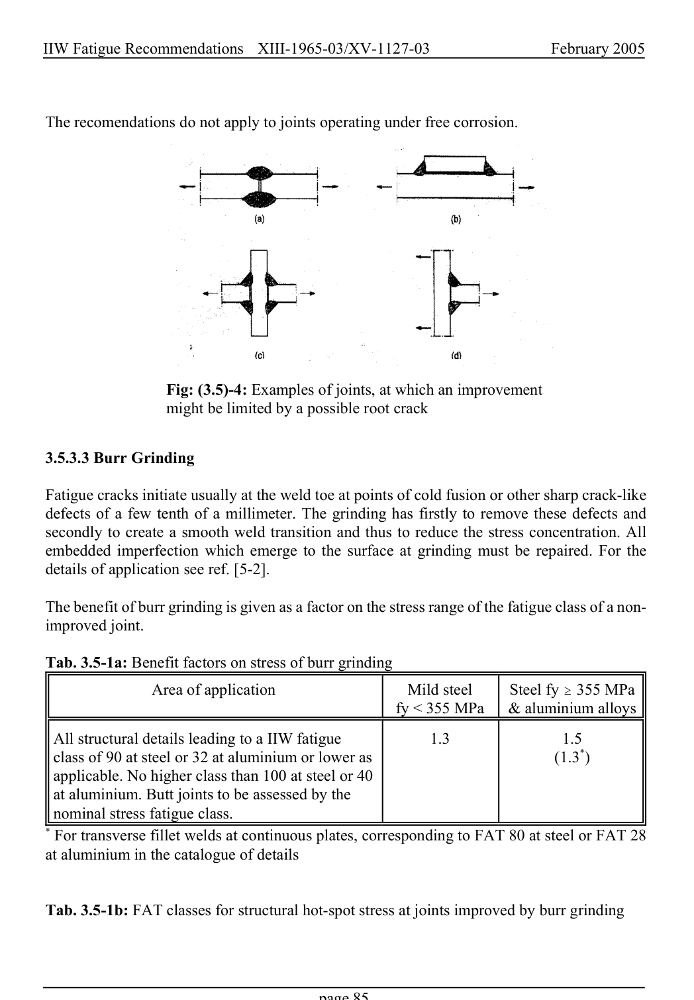

# 3.3–3.8 — Local methods, modifications and imperfections — pagina PDF 85

Fonte: [IIW — Recommendations for Fatigue Design of Welded Joints and Components](../../sources/iiw.pdf#page=85). Pagina stampata: 85.

> Formule, simboli e associazioni delle tabelle non sono convalidati per il calcolo.

## Testo estratto

IIW Fatigue Recommendations  XIII-1965-03/XV-1127-03                 February 2005

The recomendations do not apply to joints operating under free corrosion.

Fig: (3.5)-4: Examples of joints, at which an improvement might be limited by a possible root crack

3.5.3.3 Burr Grinding

Fatigue cracks initiate usually at the weld toe at points of cold fusion or other sharp crack-like defects of a few tenth of a millimeter. The grinding has firstly to remove these defects and secondly to create a smooth weld transition and thus to reduce the stress concentration. All embedded imperfection which emerge to the surface at grinding must be repaired. For the details of application see ref. [5-2].

The benefit of burr grinding is given as a factor on the stress range of the fatigue class of a non- improved joint.

```text
Tab. 3.5-1a: Benefit factors on stress of burr grinding
              Area of application                 Mild steel      Steel fy $ 355 MPa
                                                     fy < 355 MPa  & aluminium alloys
```

```text
 All structural details leading to a IIW fatigue             1.3                 1.5
  class of 90 at steel or 32 at aluminium or lower as                               (1.3*)
  applicable. No higher class than 100 at steel or 40
  at aluminium. Butt joints to be assessed by the
 nominal stress fatigue class.
* For transverse fillet welds at continuous plates, corresponding to FAT 80 at steel or FAT 28
at aluminium in the catalogue of details
```

Tab. 3.5-1b: FAT classes for structural hot-spot stress at joints improved by burr grinding

page 85

## Pagina di riscontro


