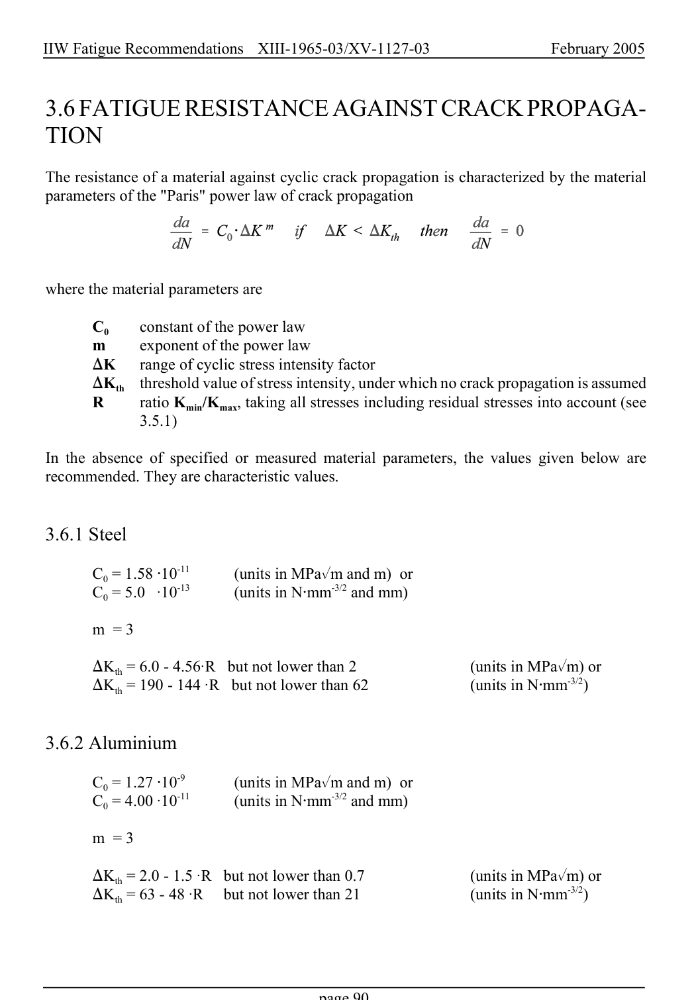

# 3.3–3.8 — Local methods, modifications and imperfections — pagina PDF 90

Fonte: [IIW — Recommendations for Fatigue Design of Welded Joints and Components](../../sources/iiw.pdf#page=90). Pagina stampata: 90.

> Formule, simboli e associazioni delle tabelle non sono convalidati per il calcolo.

## Testo estratto

IIW Fatigue Recommendations  XIII-1965-03/XV-1127-03                 February 2005

3.6 FATIGUE RESISTANCE AGAINST CRACK PROPAGA- TION

The resistance of a material against cyclic crack propagation is characterized by the material parameters of the "Paris" power law of crack propagation

where the material parameters are

```text
      C0     constant of the power law
    m     exponent of the power law
    )K   range of cyclic stress intensity factor
      )Kth  threshold value of stress intensity, under which no crack propagation is assumed
    R      ratio Kmin/Kmax, taking all stresses including residual stresses into account (see
                3.5.1)
```

In the absence of specified or measured material parameters, the values given below are recommended. They are characteristic values.

```text
3.6.1 Steel
      C0 = 1.58 @10-11       (units in MPa%m and m) or
      C0 = 5.0  A10-13       (units in N@mm-3/2 and mm)
```

```text
    m = 3
       )Kth = 6.0 - 4.56AR  but not lower than 2                   (units in MPa%m) or
       )Kth = 190 - 144 AR  but not lower than 62                 (units in N@mm-3/2)
```

```text
3.6.2 Aluminium
      C0 = 1.27 @10-9        (units in MPa%m and m) or
      C0 = 4.00 A10-11       (units in N@mm-3/2 and mm)
```

```text
    m = 3
       )Kth = 2.0 - 1.5 AR  but not lower than 0.7                 (units in MPa%m) or
       )Kth = 63 - 48 AR   but not lower than 21                  (units in N@mm-3/2)
```

page 90

## Pagina di riscontro


