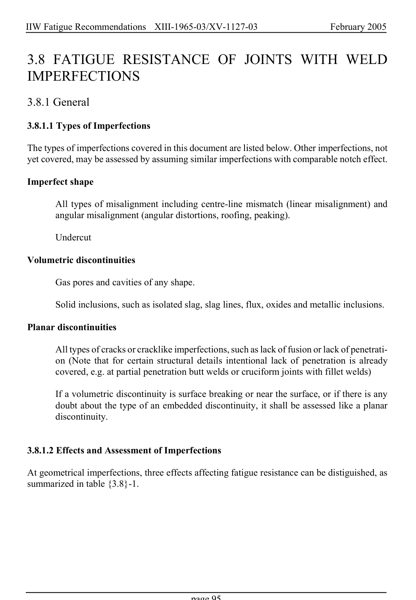

# 3.3–3.8 — Local methods, modifications and imperfections — pagina PDF 95

Fonte: [IIW — Recommendations for Fatigue Design of Welded Joints and Components](../../sources/iiw.pdf#page=95). Pagina stampata: 95.

> Formule, simboli e associazioni delle tabelle non sono convalidati per il calcolo.

## Testo estratto

IIW Fatigue Recommendations  XIII-1965-03/XV-1127-03                 February 2005

3.8 FATIGUE RESISTANCE OF JOINTS WITH WELD IMPERFECTIONS

3.8.1 General

3.8.1.1 Types of Imperfections

The types of imperfections covered in this document are listed below. Other imperfections, not yet covered, may be assessed by assuming similar imperfections with comparable notch effect.

Imperfect shape

All types of misalignment including centre-line mismatch (linear misalignment) and angular misalignment (angular distortions, roofing, peaking).

Undercut

Volumetric discontinuities

Gas pores and cavities of any shape.

Solid inclusions, such as isolated slag, slag lines, flux, oxides and metallic inclusions.

Planar discontinuities

All types of cracks or cracklike imperfections, such as lack of fusion or lack of penetrati- on (Note that for certain structural details intentional lack of penetration is already covered, e.g. at partial penetration butt welds or cruciform joints with fillet welds)

If a volumetric discontinuity is surface breaking or near the surface, or if there is any doubt about the type of an embedded discontinuity, it shall be assessed like a planar discontinuity.

3.8.1.2 Effects and Assessment of Imperfections

At geometrical imperfections, three effects affecting fatigue resistance can be distiguished, as summarized in table {3.8}-1.

page 95

## Pagina di riscontro

