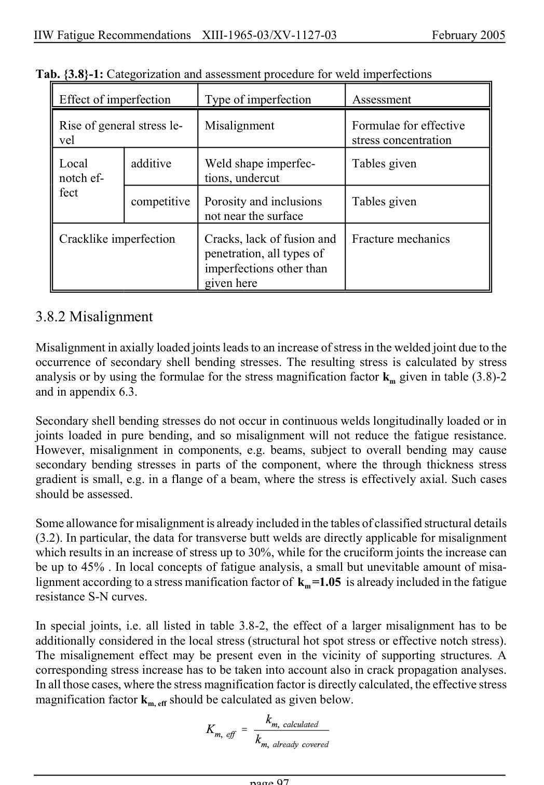

# 3.3–3.8 — Local methods, modifications and imperfections — pagina PDF 97

Fonte: [IIW — Recommendations for Fatigue Design of Welded Joints and Components](../../sources/iiw.pdf#page=97). Pagina stampata: 97.

> Formule, simboli e associazioni delle tabelle non sono convalidati per il calcolo.

## Testo estratto

IIW Fatigue Recommendations  XIII-1965-03/XV-1127-03                 February 2005

Tab. {3.8}-1: Categorization and assessment procedure for weld imperfections

Effect of imperfection     Type of imperfection       Assessment

Rise of general stress le-    Misalignment             Formulae for effective vel                                                            stress concentration

```text
    Local         additive     Weld shape imperfec-       Tables given
     notch ef-                      tions, undercut
     fect
                  competitive   Porosity and inclusions     Tables given
                                not near the surface
```

```text
     Cracklike imperfection     Cracks, lack of fusion and   Fracture mechanics
                                  penetration, all types of
                                imperfections other than
                               given here
```

3.8.2 Misalignment

Misalignment in axially loaded joints leads to an increase of stress in the welded joint due to the occurrence of secondary shell bending stresses. The resulting stress is calculated by stress analysis or by using the formulae for the stress magnification factor km given in table (3.8)-2 and in appendix 6.3.

Secondary shell bending stresses do not occur in continuous welds longitudinally loaded or in joints loaded in pure bending, and so misalignment will not reduce the fatigue resistance. However, misalignment in components, e.g. beams, subject to overall bending may cause secondary bending stresses in parts of the component, where the through thickness stress gradient is small, e.g. in a flange of a beam, where the stress is effectively axial. Such cases should be assessed.

Some allowance for misalignment is already included in the tables of classified structural details (3.2). In particular, the data for transverse butt welds are directly applicable for misalignment which results in an increase of stress up to 30%, while for the cruciform joints the increase can be up to 45% . In local concepts of fatigue analysis, a small but unevitable amount of misa- lignment according to a stress manification factor of km =1.05 is already included in the fatigue resistance S-N curves.

In special joints, i.e. all listed in table 3.8-2, the effect of a larger misalignment has to be additionally considered in the local stress (structural hot spot stress or effective notch stress). The misalignement effect may be present even in the vicinity of supporting structures. A corresponding stress increase has to be taken into account also in crack propagation analyses. In all those cases, where the stress magnification factor is directly calculated, the effective stress magnification factor km, eff should be calculated as given below.

page 97

## Pagina di riscontro


