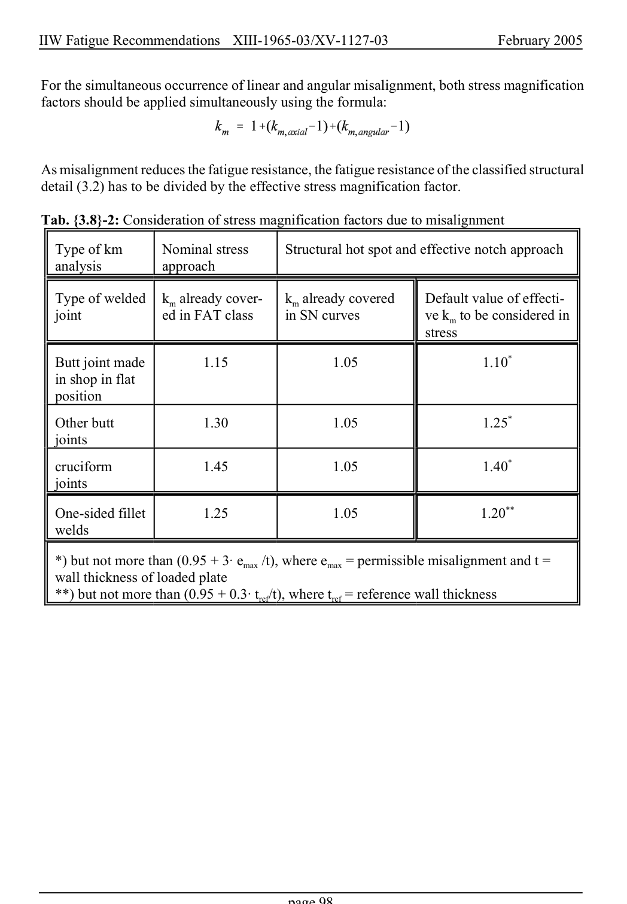

# 3.3–3.8 — Local methods, modifications and imperfections — pagina PDF 98

Fonte: [IIW — Recommendations for Fatigue Design of Welded Joints and Components](../../sources/iiw.pdf#page=98). Pagina stampata: 98.

> Formule, simboli e associazioni delle tabelle non sono convalidati per il calcolo.

## Testo estratto

IIW Fatigue Recommendations  XIII-1965-03/XV-1127-03                 February 2005

For the simultaneous occurrence of linear and angular misalignment, both stress magnification factors should be applied simultaneously using the formula:

As misalignment reduces the fatigue resistance, the fatigue resistance of the classified structural detail (3.2) has to be divided by the effective stress magnification factor.

Tab. {3.8}-2: Consideration of stress magnification factors due to misalignment

Type of km     Nominal stress      Structural hot spot and effective notch approach analysis         approach

```text
  Type of welded  km already cover-   km already covered     Default value of effecti-
   joint            ed in FAT class      in SN curves          ve km to be considered in
                                                                        stress
```

```text
   Butt joint made         1.15                 1.05                     1.10*
   in shop in flat
   position
```

Other butt              1.30                 1.05                     1.25* joints

cruciform              1.45                 1.05                     1.40* joints

One-sided fillet         1.25                 1.05                      1.20** welds

*) but not more than (0.95 + 3A emax /t), where emax = permissible misalignment and t = wall thickness of loaded plate **) but not more than (0.95 + 0.3A tref/t), where tref = reference wall thickness

page 98

## Pagina di riscontro


