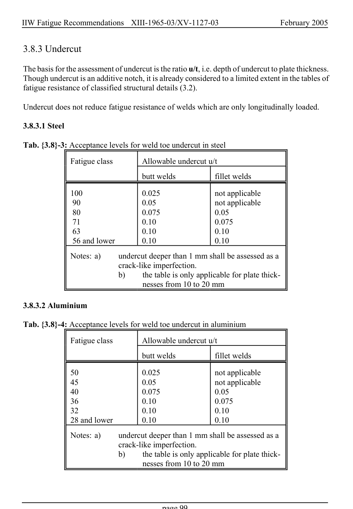

# 3.3–3.8 — Local methods, modifications and imperfections — pagina PDF 99

Fonte: [IIW — Recommendations for Fatigue Design of Welded Joints and Components](../../sources/iiw.pdf#page=99). Pagina stampata: 99.

> Formule, simboli e associazioni delle tabelle non sono convalidati per il calcolo.

## Testo estratto

IIW Fatigue Recommendations  XIII-1965-03/XV-1127-03                 February 2005

3.8.3 Undercut

The basis for the assessment of undercut is the ratio u/t, i.e. depth of undercut to plate thickness. Though undercut is an additive notch, it is already considered to a limited extent in the tables of fatigue resistance of classified structural details (3.2).

Undercut does not reduce fatigue resistance of welds which are only longitudinally loaded.

3.8.3.1 Steel

Tab. {3.8}-3: Acceptance levels for weld toe undercut in steel

Fatigue class        Allowable undercut u/t

butt welds               fillet welds

```text
            100                0.025                not applicable
            90                 0.05                 not applicable
            80                 0.075               0.05
            71                 0.10                0.075
            63                 0.10                0.10
            56 and lower        0.10                0.10
```

```text
              Notes: a)     undercut deeper than 1 mm shall be assessed as a
                              crack-like imperfection.
                            b)     the table is only applicable for plate thick-
                                   nesses from 10 to 20 mm
```

3.8.3.2 Aluminium

Tab. {3.8}-4: Acceptance levels for weld toe undercut in aluminium

Fatigue class        Allowable undercut u/t

butt welds               fillet welds

```text
            50                 0.025                not applicable
            45                  0.05                 not applicable
            40                 0.075               0.05
            36                  0.10                0.075
            32                  0.10                0.10
            28 and lower        0.10                0.10
```

```text
              Notes: a)     undercut deeper than 1 mm shall be assessed as a
                              crack-like imperfection.
                            b)     the table is only applicable for plate thick-
                                   nesses from 10 to 20 mm
```

page 99

## Pagina di riscontro


