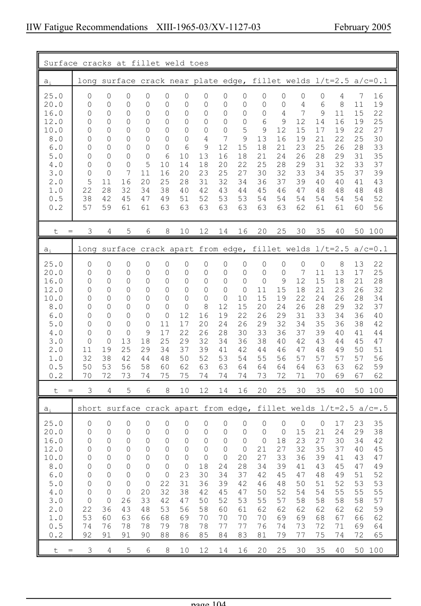

# 3.3–3.8 — Local methods, modifications and imperfections — pagina PDF 104

Fonte: [IIW — Recommendations for Fatigue Design of Welded Joints and Components](../../sources/iiw.pdf#page=104). Pagina stampata: 104.

> Formule, simboli e associazioni delle tabelle non sono convalidati per il calcolo.

## Testo estratto

IIW Fatigue Recommendations  XIII-1965-03/XV-1127-03                 February 2005

Surface cracks at fillet weld toes

ai     long surface crack near plate edge, fillet welds l/t=2.5 a/c=0.1

```text
    25.0     0   0   0   0   0   0   0   0   0   0   0   0   0   4   7  16
    20.0     0   0   0   0   0   0   0   0   0   0   0   4   6   8  11  19
    16.0     0   0   0   0   0   0   0   0   0   0   4   7   9  11  15  22
    12.0     0   0   0   0   0   0   0   0   0   6   9  12  14  16  19  25
    10.0     0   0   0   0   0   0   0   0   5   9  12  15  17  19  22  27
     8.0     0   0   0   0   0   0   4   7   9  13  16  19  21  22  25  30
     6.0     0   0   0   0   0   6   9  12  15  18  21  23  25  26  28  33
     5.0     0   0   0   0   6  10  13  16  18  21  24  26  28  29  31  35
     4.0     0   0   0   5  10  14  18  20  22  25  28  29  31  32  33  37
     3.0     0   0   7  11  16  20  23  25  27  30  32  33  34  35  37  39
     2.0     5  11  16  20  25  28  31  32  34  36  37  39  40  40  41  43
     1.0    22  28  32  34  38  40  42  43  44  45  46  47  48  48  48  48
     0.5    38  42  45  47  49  51  52  53  53  54  54  54  54  54  54  52
     0.2    57  59  61  61  63  63  63  63  63  63  63  62  61  61  60  56
```

t  =   3   4   5   6   8  10  12  14  16  20  25  30  35  40  50 100

ai     long surface crack apart from edge, fillet welds l/t=2.5 a/c=0.1

```text
    25.0     0   0   0   0   0   0   0   0   0   0   0   0   0   8  13  22
    20.0     0   0   0   0   0   0   0   0   0   0   0   7  11  13  17  25
    16.0     0   0   0   0   0   0   0   0   0   0   9  12  15  18  21  28
    12.0     0   0   0   0   0   0   0   0   0  11  15  18  21  23  26  32
    10.0     0   0   0   0   0   0   0   0  10  15  19  22  24  26  28  34
     8.0     0   0   0   0   0   0   8  12  15  20  24  26  28  29  32  37
     6.0     0   0   0   0   0  12  16  19  22  26  29  31  33  34  36  40
     5.0     0   0   0   0  11  17  20  24  26  29  32  34  35  36  38  42
     4.0     0   0   0   9  17  22  26  28  30  33  36  37  39  40  41  44
     3.0     0   0  13  18  25  29  32  34  36  38  40  42  43  44  45  47
     2.0    11  19  25  29  34  37  39  41  42  44  46  47  48  49  50  51
     1.0    32  38  42  44  48  50  52  53  54  55  56  57  57  57  57  56
     0.5    50  53  56  58  60  62  63  63  64  64  64  64  63  63  62  59
     0.2    70  72  73  74  75  75  74  74  74  73  72  71  70  69  67  62
```

t  =   3   4   5   6   8  10  12  14  16  20  25  30  35  40  50 100

ai     short surface crack apart from edge, fillet welds l/t=2.5 a/c=.5

```text
    25.0     0   0   0   0   0   0   0   0   0   0   0   0   0  17  23  35
    20.0     0   0   0   0   0   0   0   0   0   0   0  15  21  24  29  38
    16.0     0   0   0   0   0   0   0   0   0   0  18  23  27  30  34  42
    12.0     0   0   0   0   0   0   0   0   0  21  27  32  35  37  40  45
    10.0     0   0   0   0   0   0   0   0  20  27  33  36  39  41  43  47
     8.0     0   0   0   0   0   0  18  24  28  34  39  41  43  45  47  49
     6.0     0   0   0   0   0  23  30  34  37  42  45  47  48  49  51  52
     5.0     0   0   0   0  22  31  36  39  42  46  48  50  51  52  53  53
     4.0     0   0   0  20  32  38  42  45  47  50  52  54  54  55  55  55
     3.0     0   0  26  33  42  47  50  52  53  55  57  58  58  58  58  57
     2.0    22  36  43  48  53  56  58  60  61  62  62  62  62  62  62  59
     1.0    53  60  63  66  68  69  70  70  70  70  69  69  68  67  66  62
     0.5    74  76  78  78  79  78  78  77  77  76  74  73  72  71  69  64
     0.2    92  91  91  90  88  86  85  84  83  81  79  77  75  74  72  65
```

t  =   3   4   5   6   8  10  12  14  16  20  25  30  35  40  50 100

page 104

## Pagina di riscontro


