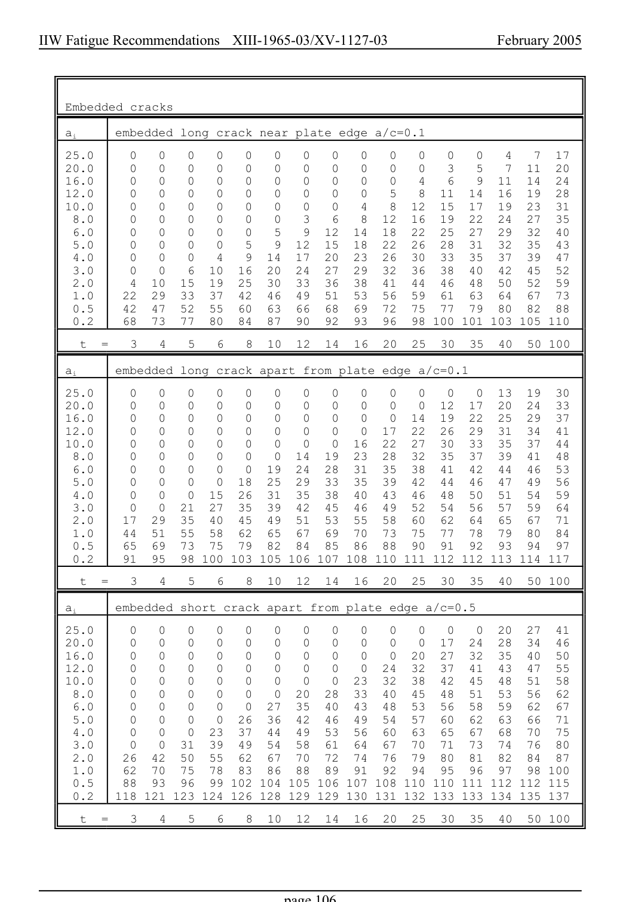

# 3.3–3.8 — Local methods, modifications and imperfections — pagina PDF 106

Fonte: [IIW — Recommendations for Fatigue Design of Welded Joints and Components](../../sources/iiw.pdf#page=106). Pagina stampata: 106.

> Formule, simboli e associazioni delle tabelle non sono convalidati per il calcolo.

## Testo estratto

IIW Fatigue Recommendations  XIII-1965-03/XV-1127-03                 February 2005

Embedded cracks

ai     embedded long crack near plate edge a/c=0.1

```text
    25.0     0   0   0   0   0   0   0   0   0   0   0   0   0   4   7  17
    20.0     0   0   0   0   0   0   0   0   0   0   0   3   5   7  11  20
    16.0     0   0   0   0   0   0   0   0   0   0   4   6   9  11  14  24
    12.0     0   0   0   0   0   0   0   0   0   5   8  11  14  16  19  28
    10.0     0   0   0   0   0   0   0   0   4   8  12  15  17  19  23  31
     8.0     0   0   0   0   0   0   3   6   8  12  16  19  22  24  27  35
     6.0     0   0   0   0   0   5   9  12  14  18  22  25  27  29  32  40
     5.0     0   0   0   0   5   9  12  15  18  22  26  28  31  32  35  43
     4.0     0   0   0   4   9  14  17  20  23  26  30  33  35  37  39  47
     3.0     0   0   6  10  16  20  24  27  29  32  36  38  40  42  45  52
     2.0     4  10  15  19  25  30  33  36  38  41  44  46  48  50  52  59
     1.0    22  29  33  37  42  46  49  51  53  56  59  61  63  64  67  73
     0.5    42  47  52  55  60  63  66  68  69  72  75  77  79  80  82  88
     0.2    68  73  77  80  84  87  90  92  93  96  98 100 101 103 105 110
```

t  =   3   4   5   6   8  10  12  14  16  20  25  30  35  40  50 100

ai     embedded long crack apart from plate edge a/c=0.1

```text
    25.0     0   0   0   0   0   0   0   0   0   0   0   0   0  13  19  30
    20.0     0   0   0   0   0   0   0   0   0   0   0  12  17  20  24  33
    16.0     0   0   0   0   0   0   0   0   0   0  14  19  22  25  29  37
    12.0     0   0   0   0   0   0   0   0   0  17  22  26  29  31  34  41
    10.0     0   0   0   0   0   0   0   0  16  22  27  30  33  35  37  44
     8.0     0   0   0   0   0   0  14  19  23  28  32  35  37  39  41  48
     6.0     0   0   0   0   0  19  24  28  31  35  38  41  42  44  46  53
     5.0     0   0   0   0  18  25  29  33  35  39  42  44  46  47  49  56
     4.0     0   0   0  15  26  31  35  38  40  43  46  48  50  51  54  59
     3.0     0   0  21  27  35  39  42  45  46  49  52  54  56  57  59  64
     2.0    17  29  35  40  45  49  51  53  55  58  60  62  64  65  67  71
     1.0    44  51  55  58  62  65  67  69  70  73  75  77  78  79  80  84
     0.5    65  69  73  75  79  82  84  85  86  88  90  91  92  93  94  97
     0.2    91  95  98 100 103 105 106 107 108 110 111 112 112 113 114 117
```

t  =   3   4   5   6   8  10  12  14  16  20  25  30  35  40  50 100

ai     embedded short crack apart from plate edge a/c=0.5

```text
    25.0     0   0   0   0   0   0   0   0   0   0   0   0   0  20  27  41
    20.0     0   0   0   0   0   0   0   0   0   0   0  17  24  28  34  46
    16.0     0   0   0   0   0   0   0   0   0   0  20  27  32  35  40  50
    12.0     0   0   0   0   0   0   0   0   0  24  32  37  41  43  47  55
    10.0     0   0   0   0   0   0   0   0  23  32  38  42  45  48  51  58
     8.0     0   0   0   0   0   0  20  28  33  40  45  48  51  53  56  62
     6.0     0   0   0   0   0  27  35  40  43  48  53  56  58  59  62  67
     5.0     0   0   0   0  26  36  42  46  49  54  57  60  62  63  66  71
     4.0     0   0   0  23  37  44  49  53  56  60  63  65  67  68  70  75
     3.0     0   0  31  39  49  54  58  61  64  67  70  71  73  74  76  80
     2.0    26  42  50  55  62  67  70  72  74  76  79  80  81  82  84  87
     1.0    62  70  75  78  83  86  88  89  91  92  94  95  96  97  98 100
     0.5    88  93  96  99 102 104 105 106 107 108 110 110 111 112 112 115
     0.2   118 121 123 124 126 128 129 129 130 131 132 133 133 134 135 137
```

t  =   3   4   5   6   8  10  12  14  16  20  25  30  35  40  50 100

page 106

## Pagina di riscontro


