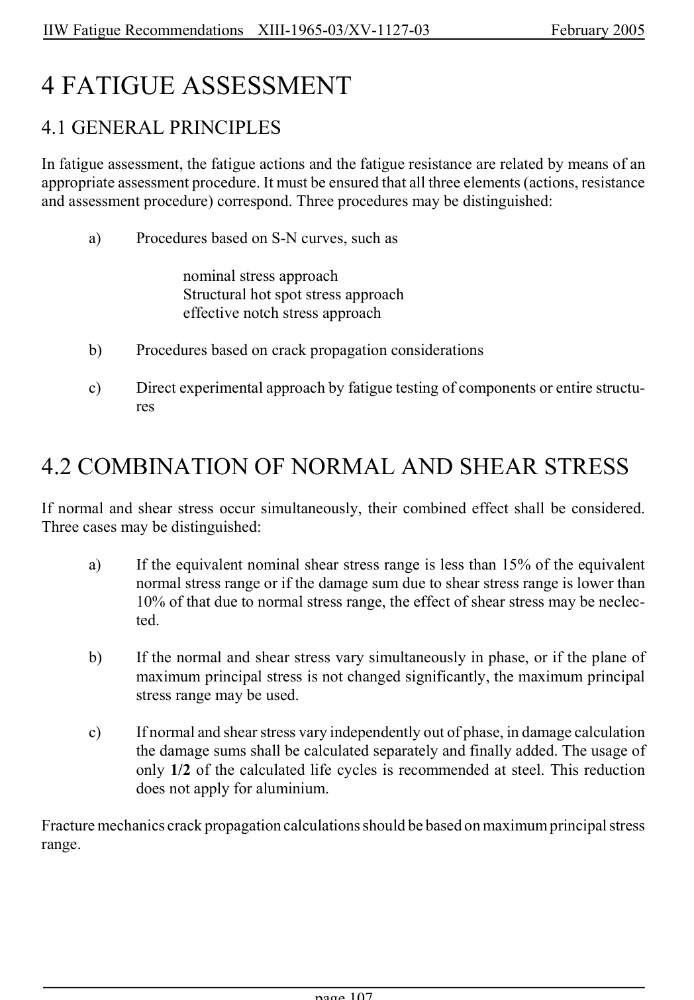

# 4 — Fatigue assessment — pagina PDF 107

Fonte: [IIW — Recommendations for Fatigue Design of Welded Joints and Components](../../sources/iiw.pdf#page=107). Pagina stampata: 107.

> Formule, simboli e associazioni delle tabelle non sono convalidati per il calcolo.

## Testo estratto

IIW Fatigue Recommendations  XIII-1965-03/XV-1127-03                 February 2005

4 FATIGUE ASSESSMENT

4.1 GENERAL PRINCIPLES

In fatigue assessment, the fatigue actions and the fatigue resistance are related by means of an appropriate assessment procedure. It must be ensured that all three elements (actions, resistance and assessment procedure) correspond. Three procedures may be distinguished:

a)     Procedures based on S-N curves, such as

nominal stress approach Structural hot spot stress approach effective notch stress approach

b)     Procedures based on crack propagation considerations

c)     Direct experimental approach by fatigue testing of components or entire structu- res

4.2 COMBINATION OF NORMAL AND SHEAR STRESS

If normal and shear stress occur simultaneously, their combined effect shall be considered. Three cases may be distinguished:

```text
        a)       If the equivalent nominal shear stress range is less than 15% of the equivalent
             normal stress range or if the damage sum due to shear stress range is lower than
          10% of that due to normal stress range, the effect of shear stress may be neclec-
                ted.
```

```text
       b)      If the normal and shear stress vary simultaneously in phase, or if the plane of
          maximum principal stress is not changed significantly, the maximum principal
                stress range may be used.
```

```text
        c)       If normal and shear stress vary independently out of phase, in damage calculation
              the damage sums shall be calculated separately and finally added. The usage of
             only 1/2 of the calculated life cycles is recommended at steel. This reduction
             does not apply for aluminium.
```

Fracture mechanics crack propagation calculations should be based on maximum principal stress range.

page 107

## Pagina di riscontro


