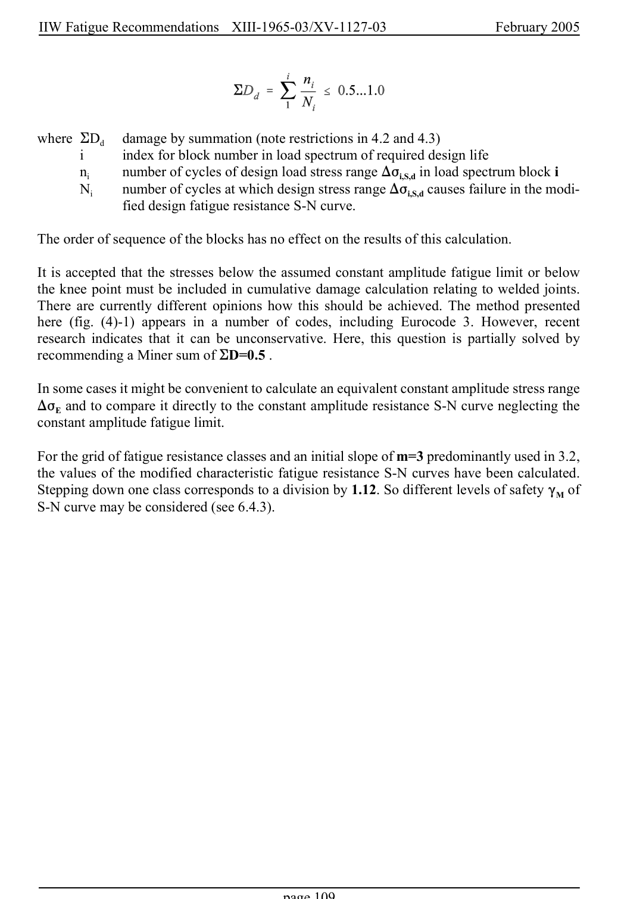

# 4 — Fatigue assessment — pagina PDF 109

Fonte: [IIW — Recommendations for Fatigue Design of Welded Joints and Components](../../sources/iiw.pdf#page=109). Pagina stampata: 109.

> Formule, simboli e associazioni delle tabelle non sono convalidati per il calcolo.

## Testo estratto

IIW Fatigue Recommendations  XIII-1965-03/XV-1127-03                 February 2005

```text
where EDd  damage by summation (note restrictions in 4.2 and 4.3)
           i      index for block number in load spectrum of required design life
         ni    number of cycles of design load stress range )Fi,S,d in load spectrum block i
       Ni    number of cycles at which design stress range )Fi,S,d causes failure in the modi-
               fied design fatigue resistance S-N curve.
```

The order of sequence of the blocks has no effect on the results of this calculation.

It is accepted that the stresses below the assumed constant amplitude fatigue limit or below the knee point must be included in cumulative damage calculation relating to welded joints. There are currently different opinions how this should be achieved. The method presented here (fig. (4)-1) appears in a number of codes, including Eurocode 3. However, recent research indicates that it can be unconservative. Here, this question is partially solved by recommending a Miner sum of ED=0.5 .

In some cases it might be convenient to calculate an equivalent constant amplitude stress range )FE and to compare it directly to the constant amplitude resistance S-N curve neglecting the constant amplitude fatigue limit.

For the grid of fatigue resistance classes and an initial slope of m=3 predominantly used in 3.2, the values of the modified characteristic fatigue resistance S-N curves have been calculated. Stepping down one class corresponds to a division by 1.12. So different levels of safety (M of S-N curve may be considered (see 6.4.3).

page 109

## Pagina di riscontro


