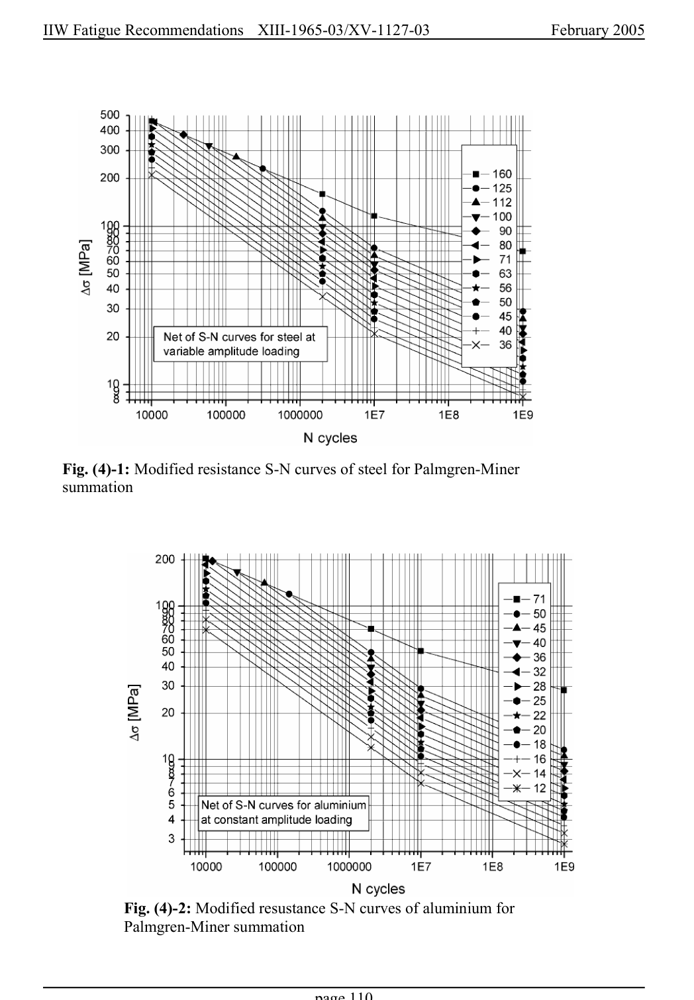

# 4 — Fatigue assessment — pagina PDF 110

Fonte: [IIW — Recommendations for Fatigue Design of Welded Joints and Components](../../sources/iiw.pdf#page=110). Pagina stampata: 110.

> Formule, simboli e associazioni delle tabelle non sono convalidati per il calcolo.

## Testo estratto

IIW Fatigue Recommendations  XIII-1965-03/XV-1127-03                 February 2005

Fig. (4)-1: Modified resistance S-N curves of steel for Palmgren-Miner summation

Fig. (4)-2: Modified resustance S-N curves of aluminium for Palmgren-Miner summation

page 110

## Pagina di riscontro

