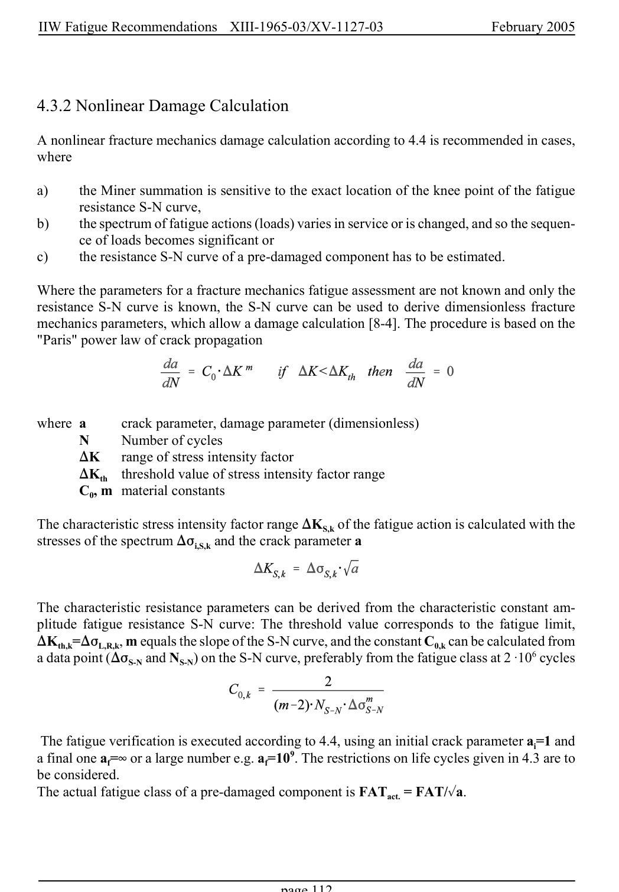

# 4 — Fatigue assessment — pagina PDF 112

Fonte: [IIW — Recommendations for Fatigue Design of Welded Joints and Components](../../sources/iiw.pdf#page=112). Pagina stampata: 112.

> Formule, simboli e associazioni delle tabelle non sono convalidati per il calcolo.

## Testo estratto

IIW Fatigue Recommendations  XIII-1965-03/XV-1127-03                 February 2005

4.3.2 Nonlinear Damage Calculation

A nonlinear fracture mechanics damage calculation according to 4.4 is recommended in cases, where

```text
a)     the Miner summation is sensitive to the exact location of the knee point of the fatigue
       resistance S-N curve,
b)     the spectrum of fatigue actions (loads) varies in service or is changed, and so the sequen-
       ce of loads becomes significant or
c)     the resistance S-N curve of a pre-damaged component has to be estimated.
```

Where the parameters for a fracture mechanics fatigue assessment are not known and only the resistance S-N curve is known, the S-N curve can be used to derive dimensionless fracture mechanics parameters, which allow a damage calculation [8-4]. The procedure is based on the "Paris" power law of crack propagation

```text
where a      crack parameter, damage parameter (dimensionless)
    N    Number of cycles
    )K   range of stress intensity factor
      )Kth  threshold value of stress intensity factor range
       C0, m material constants
```

The characteristic stress intensity factor range )KS,k of the fatigue action is calculated with the stresses of the spectrum )Fi,S,k and the crack parameter a

The characteristic resistance parameters can be derived from the characteristic constant am- plitude fatigue resistance S-N curve: The threshold value corresponds to the fatigue limit, )Kth,k=)FL,R,k, m equals the slope of the S-N curve, and the constant C0,k can be calculated from a data point ()FS-N and NS-N) on the S-N curve, preferably from the fatigue class at 2 A106 cycles

The fatigue verification is executed according to 4.4, using an initial crack parameter ai=1 and a final one af=4 or a large number e.g. af=109. The restrictions on life cycles given in 4.3 are to be considered. The actual fatigue class of a pre-damaged component is FATact. = FAT/%a.

page 112

## Pagina di riscontro


