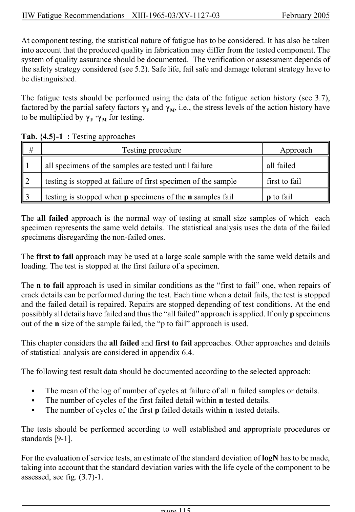

# 4 — Fatigue assessment — pagina PDF 115

Fonte: [IIW — Recommendations for Fatigue Design of Welded Joints and Components](../../sources/iiw.pdf#page=115). Pagina stampata: 115.

> Formule, simboli e associazioni delle tabelle non sono convalidati per il calcolo.

## Testo estratto

IIW Fatigue Recommendations  XIII-1965-03/XV-1127-03                 February 2005

At component testing, the statistical nature of fatigue has to be considered. It has also be taken into account that the produced quality in fabrication may differ from the tested component. The system of quality assurance should be documented. The verification or assessment depends of the safety strategy considered (see 5.2). Safe life, fail safe and damage tolerant strategy have to be distinguished.

The fatigue tests should be performed using the data of the fatigue action history (see 3.7), factored by the partial safety factors (F and (M, i.e., the stress levels of the action history have to be multiplied by (F @(M for testing.

Tab. {4.5}-1  : Testing approaches

#                         Testing procedure                        Approach

1      all specimens of the samples are tested until failure                    all failed

2     testing is stopped at failure of first specimen of the sample           first to fail

3     testing is stopped when p specimens of the n samples fail       p to fail

```text
The all failed approach is the normal way of testing at small size samples of which  each
specimen represents the same weld details. The statistical analysis uses the data of the failed
specimens disregarding the non-failed ones.
```

The first to fail approach may be used at a large scale sample with the same weld details and loading. The test is stopped at the first failure of a specimen.

The n to fail approach is used in similar conditions as the “first to fail” one, when repairs of crack details can be performed during the test. Each time when a detail fails, the test is stopped and the failed detail is repaired. Repairs are stopped depending of test conditions. At the end possibbly all details have failed and thus the “all failed” approach is applied. If only p specimens out of the n size of the sample failed, the “p to fail” approach is used.

This chapter considers the all failed and first to fail approaches. Other approaches and details of statistical analysis are considered in appendix 6.4.

The following test result data should be documented according to the selected approach:

```text
   C  The mean of the log of number of cycles at failure of all n failed samples or details.
   C  The number of cycles of the first failed detail within n tested details.
   C  The number of cycles of the first p failed details within n tested details.
```

The tests should be performed according to well established and appropriate procedures or standards [9-1].

For the evaluation of service tests, an estimate of the standard deviation of logN has to be made, taking into account that the standard deviation varies with the life cycle of the component to be assessed, see fig. (3.7)-1.

page 115

## Pagina di riscontro


