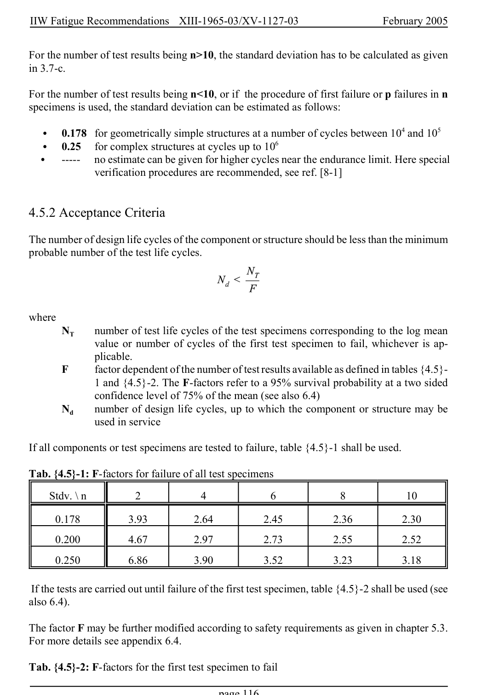

# 4 — Fatigue assessment — pagina PDF 116

Fonte: [IIW — Recommendations for Fatigue Design of Welded Joints and Components](../../sources/iiw.pdf#page=116). Pagina stampata: 116.

> Formule, simboli e associazioni delle tabelle non sono convalidati per il calcolo.

## Testo estratto

IIW Fatigue Recommendations  XIII-1965-03/XV-1127-03                 February 2005

For the number of test results being n>10, the standard deviation has to be calculated as given in 3.7-c.

For the number of test results being n<10, or if the procedure of first failure or p failures in n specimens is used, the standard deviation can be estimated as follows:

```text
   C   0.178  for geometrically simple structures at a number of cycles between 104 and 105
   C   0.25   for complex structures at cycles up to 106
   C    -----   no estimate can be given for higher cycles near the endurance limit. Here special
               verification procedures are recommended, see ref. [8-1]
```

4.5.2 Acceptance Criteria

The number of design life cycles of the component or structure should be less than the minimum probable number of the test life cycles.

```text
where
     NT    number of test life cycles of the test specimens corresponding to the log mean
              value or number of cycles of the first test specimen to fail, whichever is ap-
                plicable.
     F      factor dependent of the number of test results available as defined in tables {4.5}-
            1 and {4.5}-2. The F-factors refer to a 95% survival probability at a two sided
             confidence level of 75% of the mean (see also 6.4)
      Nd    number of design life cycles, up to which the component or structure may be
             used in service
```

If all components or test specimens are tested to failure, table {4.5}-1 shall be used.

Tab. {4.5}-1: F-factors for failure of all test specimens

Stdv. \ n         2           4            6            8           10

0.178          3.93         2.64          2.45          2.36          2.30

0.200          4.67         2.97          2.73          2.55          2.52

0.250          6.86         3.90          3.52          3.23          3.18

If the tests are carried out until failure of the first test specimen, table {4.5}-2 shall be used (see also 6.4).

The factor F may be further modified according to safety requirements as given in chapter 5.3. For more details see appendix 6.4.

Tab. {4.5}-2: F-factors for the first test specimen to fail

page 116

## Pagina di riscontro


