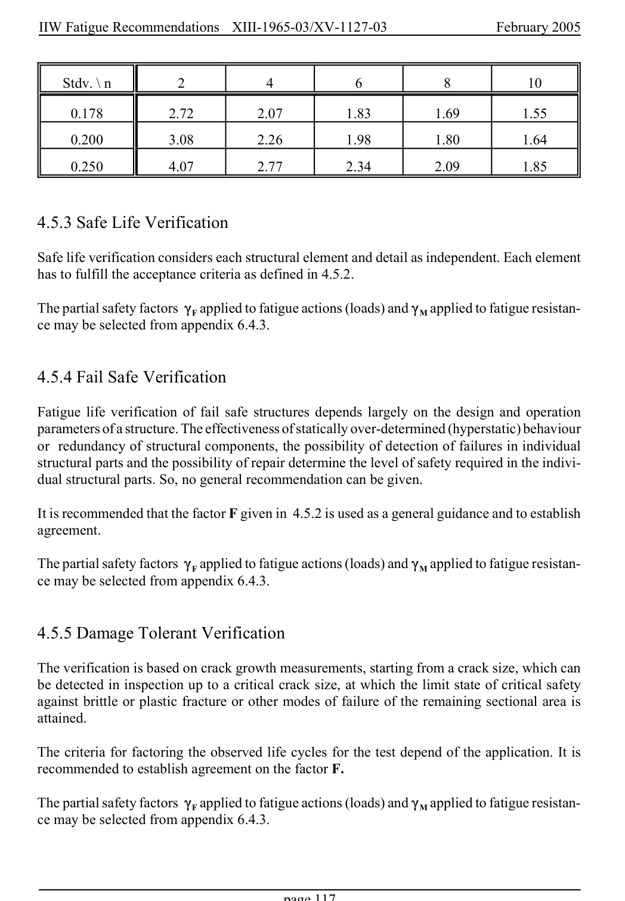

# 4 — Fatigue assessment — pagina PDF 117

Fonte: [IIW — Recommendations for Fatigue Design of Welded Joints and Components](../../sources/iiw.pdf#page=117). Pagina stampata: 117.

> Formule, simboli e associazioni delle tabelle non sono convalidati per il calcolo.

## Testo estratto

IIW Fatigue Recommendations  XIII-1965-03/XV-1127-03                 February 2005

Stdv. \ n         2           4           6           8           10

0.178          2.72          2.07          1.83          1.69          1.55

0.200          3.08          2.26          1.98          1.80          1.64

0.250          4.07          2.77          2.34          2.09          1.85

4.5.3 Safe Life Verification

Safe life verification considers each structural element and detail as independent. Each element has to fulfill the acceptance criteria as defined in 4.5.2.

The partial safety factors (F applied to fatigue actions (loads) and (M applied to fatigue resistan- ce may be selected from appendix 6.4.3.

4.5.4 Fail Safe Verification

Fatigue life verification of fail safe structures depends largely on the design and operation parameters of a structure. The effectiveness of statically over-determined (hyperstatic) behaviour or redundancy of structural components, the possibility of detection of failures in individual structural parts and the possibility of repair determine the level of safety required in the indivi- dual structural parts. So, no general recommendation can be given.

It is recommended that the factor F given in 4.5.2 is used as a general guidance and to establish agreement.

The partial safety factors (F applied to fatigue actions (loads) and (M applied to fatigue resistan- ce may be selected from appendix 6.4.3.

4.5.5 Damage Tolerant Verification

The verification is based on crack growth measurements, starting from a crack size, which can be detected in inspection up to a critical crack size, at which the limit state of critical safety against brittle or plastic fracture or other modes of failure of the remaining sectional area is attained.

The criteria for factoring the observed life cycles for the test depend of the application. It is recommended to establish agreement on the factor F.

The partial safety factors (F applied to fatigue actions (loads) and (M applied to fatigue resistan- ce may be selected from appendix 6.4.3.

page 117

## Pagina di riscontro

