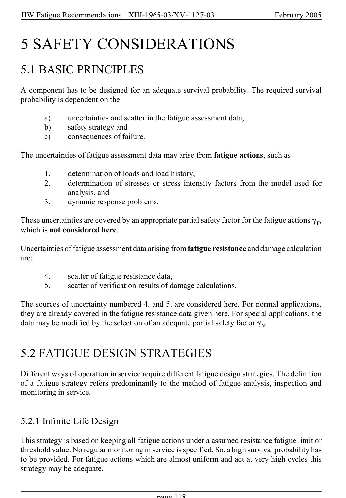

# 5 — Safety considerations — pagina PDF 118

Fonte: [IIW — Recommendations for Fatigue Design of Welded Joints and Components](../../sources/iiw.pdf#page=118). Pagina stampata: 118.

> Formule, simboli e associazioni delle tabelle non sono convalidati per il calcolo.

## Testo estratto

IIW Fatigue Recommendations  XIII-1965-03/XV-1127-03                 February 2005

5 SAFETY CONSIDERATIONS

5.1 BASIC PRINCIPLES

A component has to be designed for an adequate survival probability. The required survival probability is dependent on the

```text
        a)      uncertainties and scatter in the fatigue assessment data,
       b)     safety strategy and
        c)     consequences of failure.
```

The uncertainties of fatigue assessment data may arise from fatigue actions, such as

```text
        1.     determination of loads and load history,
        2.     determination of stresses or stress intensity factors from the model used for
               analysis, and
        3.    dynamic response problems.
```

These uncertainties are covered by an appropriate partial safety factor for the fatigue actions (F, which is not considered here.

Uncertainties of fatigue assessment data arising from fatigue resistance and damage calculation are:

4.      scatter of fatigue resistance data, 5.      scatter of verification results of damage calculations.

The sources of uncertainty numbered 4. and 5. are considered here. For normal applications, they are already covered in the fatigue resistance data given here. For special applications, the data may be modified by the selection of an adequate partial safety factor (M.

5.2 FATIGUE DESIGN STRATEGIES

Different ways of operation in service require different fatigue design strategies. The definition of a fatigue strategy refers predominantly to the method of fatigue analysis, inspection and monitoring in service.

5.2.1 Infinite Life Design

This strategy is based on keeping all fatigue actions under a assumed resistance fatigue limit or threshold value. No regular monitoring in service is specified. So, a high survival probability has to be provided. For fatigue actions which are almost uniform and act at very high cycles this strategy may be adequate.

page 118

## Pagina di riscontro


