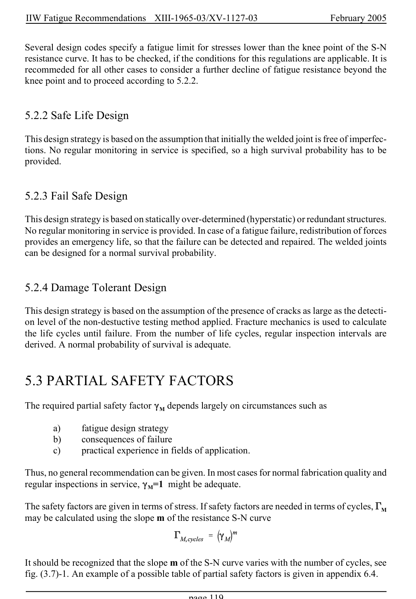

# 5 — Safety considerations — pagina PDF 119

Fonte: [IIW — Recommendations for Fatigue Design of Welded Joints and Components](../../sources/iiw.pdf#page=119). Pagina stampata: 119.

> Formule, simboli e associazioni delle tabelle non sono convalidati per il calcolo.

## Testo estratto

IIW Fatigue Recommendations  XIII-1965-03/XV-1127-03                 February 2005

Several design codes specify a fatigue limit for stresses lower than the knee point of the S-N resistance curve. It has to be checked, if the conditions for this regulations are applicable. It is recommeded for all other cases to consider a further decline of fatigue resistance beyond the knee point and to proceed according to 5.2.2.

5.2.2 Safe Life Design

This design strategy is based on the assumption that initially the welded joint is free of imperfec- tions. No regular monitoring in service is specified, so a high survival probability has to be provided.

5.2.3 Fail Safe Design

This design strategy is based on statically over-determined (hyperstatic) or redundant structures. No regular monitoring in service is provided. In case of a fatigue failure, redistribution of forces provides an emergency life, so that the failure can be detected and repaired. The welded joints can be designed for a normal survival probability.

5.2.4 Damage Tolerant Design

This design strategy is based on the assumption of the presence of cracks as large as the detecti- on level of the non-destuctive testing method applied. Fracture mechanics is used to calculate the life cycles until failure. From the number of life cycles, regular inspection intervals are derived. A normal probability of survival is adequate.

5.3 PARTIAL SAFETY FACTORS

The required partial safety factor (M depends largely on circumstances such as

```text
        a)     fatigue design strategy
       b)     consequences of failure
        c)      practical experience in fields of application.
```

Thus, no general recommendation can be given. In most cases for normal fabrication quality and regular inspections in service, (M=1 might be adequate.

The safety factors are given in terms of stress. If safety factors are needed in terms of cycles, 'M may be calculated using the slope m of the resistance S-N curve

It should be recognized that the slope m of the S-N curve varies with the number of cycles, see fig. (3.7)-1. An example of a possible table of partial safety factors is given in appendix 6.4.

page 119

## Pagina di riscontro


