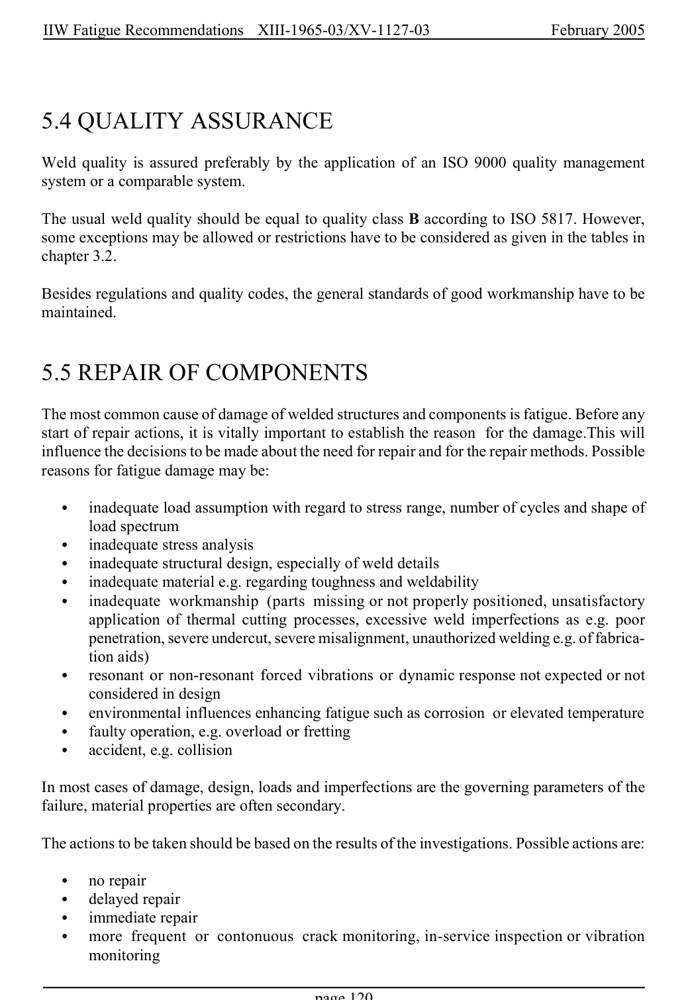

# 5 — Safety considerations — pagina PDF 120

Fonte: [IIW — Recommendations for Fatigue Design of Welded Joints and Components](../../sources/iiw.pdf#page=120). Pagina stampata: 120.

> Formule, simboli e associazioni delle tabelle non sono convalidati per il calcolo.

## Testo estratto

IIW Fatigue Recommendations  XIII-1965-03/XV-1127-03                 February 2005

5.4 QUALITY ASSURANCE

Weld quality is assured preferably by the application of an ISO 9000 quality management system or a comparable system.

The usual weld quality should be equal to quality class B according to ISO 5817. However, some exceptions may be allowed or restrictions have to be considered as given in the tables in chapter 3.2.

Besides regulations and quality codes, the general standards of good workmanship have to be maintained.

5.5 REPAIR OF COMPONENTS

```text
The most common cause of damage of welded structures and components is fatigue. Before any
start of repair actions, it is vitally important to establish the reason  for the damage.This will
influence the decisions to be made about the need for repair and for the repair methods. Possible
reasons for fatigue damage may be:
```

```text
   C   inadequate load assumption with regard to stress range, number of cycles and shape of
       load spectrum
   C   inadequate stress analysis
   C   inadequate structural design, especially of weld details
   C   inadequate material e.g. regarding toughness and weldability
   C   inadequate workmanship (parts missing or not properly positioned, unsatisfactory
       application of thermal cutting processes, excessive weld imperfections as e.g. poor
       penetration, severe undercut, severe misalignment, unauthorized welding e.g. of fabrica-
        tion aids)
   C   resonant or non-resonant forced vibrations or dynamic response not expected or not
       considered in design
   C   environmental influences enhancing fatigue such as corrosion or elevated temperature
   C   faulty operation, e.g. overload or fretting
   C   accident, e.g. collision
```

In most cases of damage, design, loads and imperfections are the governing parameters of the failure, material properties are often secondary.

The actions to be taken should be based on the results of the investigations. Possible actions are:

```text
   C   no repair
   C   delayed repair
   C   immediate repair
   C  more frequent or contonuous crack monitoring, in-service inspection or vibration
       monitoring
```

page 120

## Pagina di riscontro


