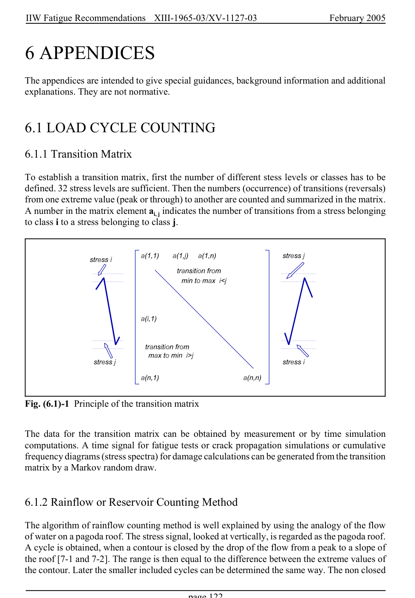

# 6 — Appendices — pagina PDF 122

Fonte: [IIW — Recommendations for Fatigue Design of Welded Joints and Components](../../sources/iiw.pdf#page=122). Pagina stampata: 122.

> Formule, simboli e associazioni delle tabelle non sono convalidati per il calcolo.

## Testo estratto

IIW Fatigue Recommendations  XIII-1965-03/XV-1127-03                 February 2005

6 APPENDICES

The appendices are intended to give special guidances, background information and additional explanations. They are not normative.

6.1 LOAD CYCLE COUNTING

6.1.1 Transition Matrix

To establish a transition matrix, first the number of different stess levels or classes has to be defined. 32 stress levels are sufficient. Then the numbers (occurrence) of transitions (reversals) from one extreme value (peak or through) to another are counted and summarized in the matrix. A number in the matrix element ai, j indicates the number of transitions from a stress belonging to class i to a stress belonging to class j.

Fig. (6.1)-1 Principle of the transition matrix

The data for the transition matrix can be obtained by measurement or by time simulation computations. A time signal for fatigue tests or crack propagation simulations or cumulative frequency diagrams (stress spectra) for damage calculations can be generated from the transition matrix by a Markov random draw.

6.1.2 Rainflow or Reservoir Counting Method

The algorithm of rainflow counting method is well explained by using the analogy of the flow of water on a pagoda roof. The stress signal, looked at vertically, is regarded as the pagoda roof. A cycle is obtained, when a contour is closed by the drop of the flow from a peak to a slope of the roof [7-1 and 7-2]. The range is then equal to the difference between the extreme values of the contour. Later the smaller included cycles can be determined the same way. The non closed

page 122

## Pagina di riscontro

