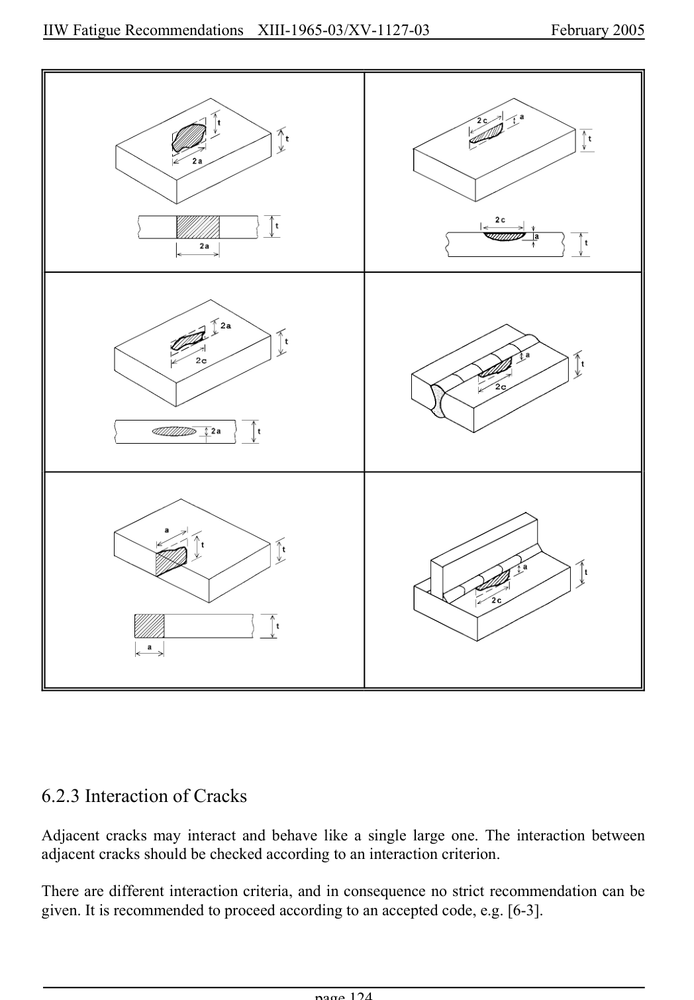

# 6 — Appendices — pagina PDF 124

Fonte: [IIW — Recommendations for Fatigue Design of Welded Joints and Components](../../sources/iiw.pdf#page=124). Pagina stampata: 124.

> Formule, simboli e associazioni delle tabelle non sono convalidati per il calcolo.

## Testo estratto

IIW Fatigue Recommendations  XIII-1965-03/XV-1127-03                 February 2005

6.2.3 Interaction of Cracks

Adjacent cracks may interact and behave like a single large one. The interaction between adjacent cracks should be checked according to an interaction criterion.

There are different interaction criteria, and in consequence no strict recommendation can be given. It is recommended to proceed according to an accepted code, e.g. [6-3].

page 124

## Pagina di riscontro

