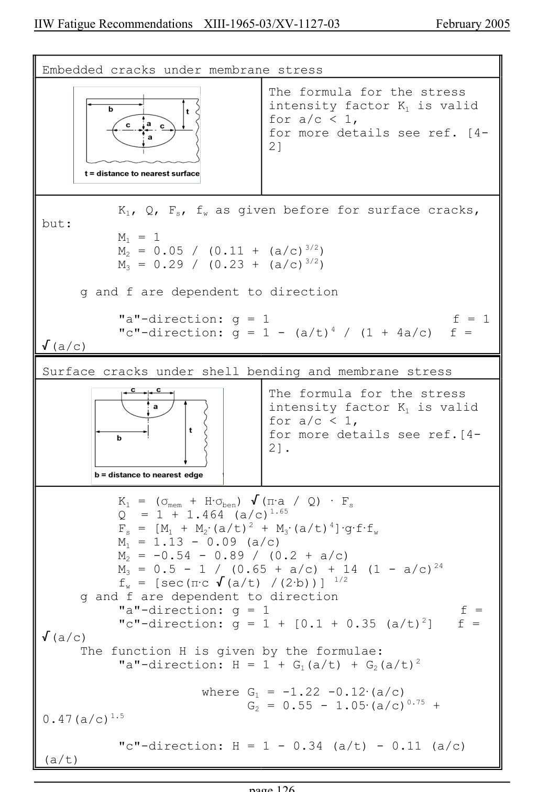

# 6 — Appendices — pagina PDF 126

Fonte: [IIW — Recommendations for Fatigue Design of Welded Joints and Components](../../sources/iiw.pdf#page=126). Pagina stampata: 126.

> Formule, simboli e associazioni delle tabelle non sono convalidati per il calcolo.

## Testo estratto

IIW Fatigue Recommendations  XIII-1965-03/XV-1127-03                 February 2005

Embedded cracks under membrane stress

The formula for the stress intensity factor K1 is valid for a/c < 1, for more details see ref. [4- 2]

K1, Q, Fs, fw as given before for surface cracks, but: M1 = 1 M2 = 0.05 / (0.11 + (a/c)3/2) M3 = 0.29 / (0.23 + (a/c)3/2)

g and f are dependent to direction

```text
           "a"-direction: g = 1                        f = 1
           "c"-direction: g = 1 - (a/t)4 / (1 + 4a/c)  f =
 /(a/c)
```

Surface cracks under shell bending and membrane stress

The formula for the stress intensity factor K1 is valid for a/c < 1, for more details see ref.[4- 2].

```text
              K1 = (Fmem + HAFben) /(BAa / Q)  A Fs
           Q  = 1 + 1.464 (a/c)1.65
              Fs = [M1 + M2A(a/t)2 + M3A(a/t)4]AgAfAfw
              M1 = 1.13 - 0.09 (a/c)
              M2 = -0.54 - 0.89 / (0.2 + a/c)
              M3 = 0.5 - 1 / (0.65 + a/c) + 14 (1 - a/c)24
              fw = [sec(BAc /(a/t) /(2Ab))]  1/2
      g and f are dependent to direction
           "a"-direction: g = 1                         f =
           "c"-direction: g = 1 + [0.1 + 0.35 (a/t)2]   f =
 /(a/c)
      The function H is given by the formulae:
           "a"-direction: H = 1 + G1(a/t) + G2(a/t)2
```

where G1 = -1.22 -0.12A(a/c) G2 = 0.55 - 1.05A(a/c)0.75 + 0.47(a/c)1.5

"c"-direction: H = 1 - 0.34 (a/t) - 0.11 (a/c) (a/t)

page 126

## Pagina di riscontro


