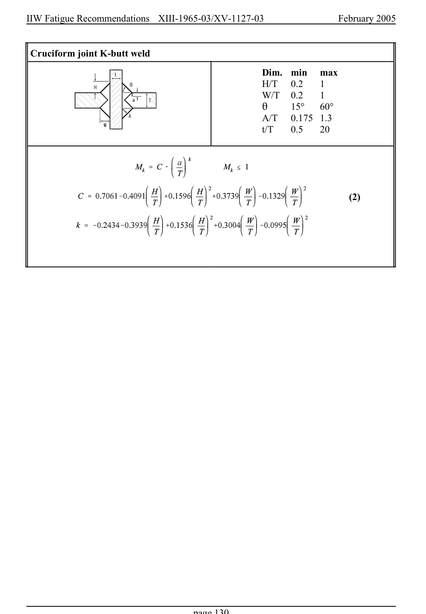

# 6 — Appendices — pagina PDF 130

Fonte: [IIW — Recommendations for Fatigue Design of Welded Joints and Components](../../sources/iiw.pdf#page=130). Pagina stampata: 130.

> Formule, simboli e associazioni delle tabelle non sono convalidati per il calcolo.

## Testo estratto

IIW Fatigue Recommendations  XIII-1965-03/XV-1127-03                 February 2005

Cruciform joint K-butt weld

```text
                                              Dim.  min  max
                                             H/T   0.2   1
                                       W/T   0.2   1
                                         2     15°   60°
                                             A/T   0.175  1.3
                                                              t/T    0.5   20
```

(2)

page 130

## Pagina di riscontro


