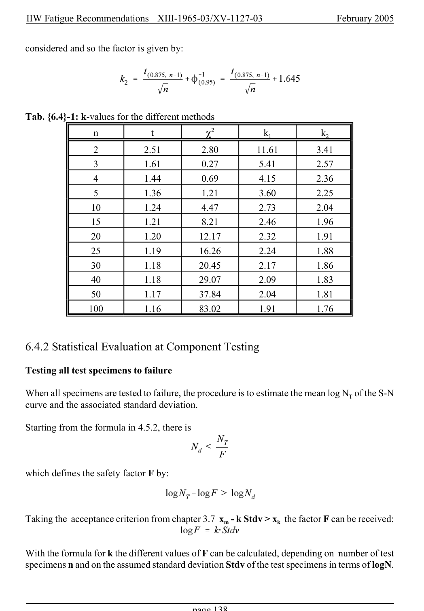

# 6 — Appendices — pagina PDF 138

Fonte: [IIW — Recommendations for Fatigue Design of Welded Joints and Components](../../sources/iiw.pdf#page=138). Pagina stampata: 138.

> Formule, simboli e associazioni delle tabelle non sono convalidati per il calcolo.

## Testo estratto

IIW Fatigue Recommendations  XIII-1965-03/XV-1127-03                 February 2005

considered and so the factor is given by:

```text
Tab. {6.4}-1: k-values for the different methods
              n                   t            P2             k1             k2
              2           2.51         2.80         11.61         3.41
              3           1.61         0.27         5.41         2.57
              4           1.44         0.69         4.15         2.36
              5           1.36         1.21         3.60         2.25
             10          1.24         4.47         2.73         2.04
             15          1.21         8.21         2.46         1.96
             20          1.20         12.17         2.32         1.91
             25          1.19         16.26         2.24         1.88
             30          1.18         20.45         2.17         1.86
             40          1.18         29.07         2.09         1.83
             50          1.17         37.84         2.04         1.81
             100          1.16         83.02         1.91         1.76
```

6.4.2 Statistical Evaluation at Component Testing

Testing all test specimens to failure

When all specimens are tested to failure, the procedure is to estimate the mean log NT of the S-N curve and the associated standard deviation.

Starting from the formula in 4.5.2, there is

which defines the safety factor F by:

Taking the acceptance criterion from chapter 3.7 xm - k Stdv > xk the factor F can be received:

With the formula for k the different values of F can be calculated, depending on number of test specimens n and on the assumed standard deviation Stdv of the test specimens in terms of logN.

page 138

## Pagina di riscontro


