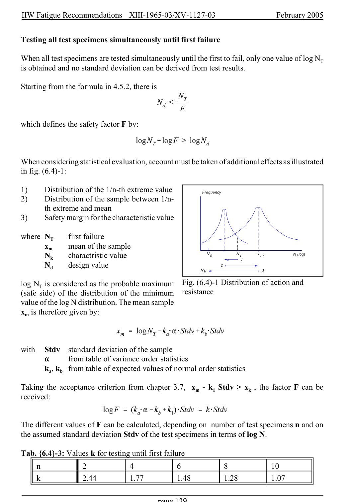

# 6 — Appendices — pagina PDF 139

Fonte: [IIW — Recommendations for Fatigue Design of Welded Joints and Components](../../sources/iiw.pdf#page=139). Pagina stampata: 139.

> Formule, simboli e associazioni delle tabelle non sono convalidati per il calcolo.

## Testo estratto

IIW Fatigue Recommendations  XIII-1965-03/XV-1127-03                 February 2005

Testing all test specimens simultaneously until first failure

When all test specimens are tested simultaneously until the first to fail, only one value of log NT is obtained and no standard deviation can be derived from test results.

Starting from the formula in 4.5.2, there is

which defines the safety factor F by:

When considering statistical evaluation, account must be taken of additional effects as illustrated in fig. (6.4)-1:

```text
1)     Distribution of the 1/n-th extreme value
2)     Distribution of the sample between 1/n-
        th extreme and mean
3)     Safety margin for the characteristic value
```

```text
where NT      first failure
      xm    mean of the sample
      Nk     charactristic value
      Nd    design value
```

```text
log NT is considered as the probable maximum  Fig. (6.4)-1 Distribution of action and
(safe side) of the distribution of the minimum   resistance
value of the log N distribution. The mean sample
xm is therefore given by:
```

```text
with  Stdv  standard deviation of the sample
     "     from table of variance order statistics
        ka, kb from table of expected values of normal order statistics
```

Taking the acceptance criterion from chapter 3.7, xm - k1 Stdv > xk  , the factor F can be received:

The different values of F can be calculated, depending on number of test specimens n and on the assumed standard deviation Stdv of the test specimens in terms of log N.

```text
Tab. {6.4}-3: Values k for testing until first failure
    n          2           4           6           8           10
    k            2.44         1.77         1.48         1.28         1.07
```

page 139

## Pagina di riscontro


