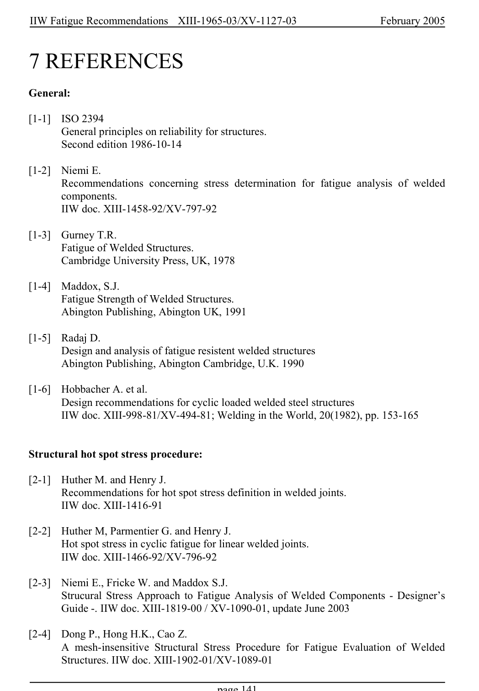

# 6 — Appendices — pagina PDF 141

Fonte: [IIW — Recommendations for Fatigue Design of Welded Joints and Components](../../sources/iiw.pdf#page=141). Pagina stampata: 141.

> Formule, simboli e associazioni delle tabelle non sono convalidati per il calcolo.

## Testo estratto

IIW Fatigue Recommendations  XIII-1965-03/XV-1127-03                 February 2005

7 REFERENCES

General:

```text
[1-1]  ISO 2394
       General principles on reliability for structures.
      Second edition 1986-10-14
```

```text
[1-2]  Niemi E.
      Recommendations concerning stress determination for fatigue analysis of welded
      components.
     IIW doc. XIII-1458-92/XV-797-92
```

```text
[1-3]  Gurney T.R.
       Fatigue of Welded Structures.
      Cambridge University Press, UK, 1978
```

```text
[1-4]  Maddox, S.J.
       Fatigue Strength of Welded Structures.
      Abington Publishing, Abington UK, 1991
```

```text
[1-5]  Radaj D.
      Design and analysis of fatigue resistent welded structures
      Abington Publishing, Abington Cambridge, U.K. 1990
```

```text
[1-6]  Hobbacher A. et al.
      Design recommendations for cyclic loaded welded steel structures
     IIW doc. XIII-998-81/XV-494-81; Welding in the World, 20(1982), pp. 153-165
```

Structural hot spot stress procedure:

```text
[2-1]  Huther M. and Henry J.
      Recommendations for hot spot stress definition in welded joints.
     IIW doc. XIII-1416-91
```

```text
[2-2]  Huther M, Parmentier G. and Henry J.
      Hot spot stress in cyclic fatigue for linear welded joints.
     IIW doc. XIII-1466-92/XV-796-92
```

```text
[2-3]  Niemi E., Fricke W. and Maddox S.J.
       Strucural Stress Approach to Fatigue Analysis of Welded Components - Designer’s
      Guide -. IIW doc. XIII-1819-00 / XV-1090-01, update June 2003
```

```text
[2-4]  Dong P., Hong H.K., Cao Z.
    A mesh-insensitive Structural Stress Procedure for Fatigue Evaluation of Welded
        Structures. IIW doc. XIII-1902-01/XV-1089-01
```

page 141

## Pagina di riscontro


