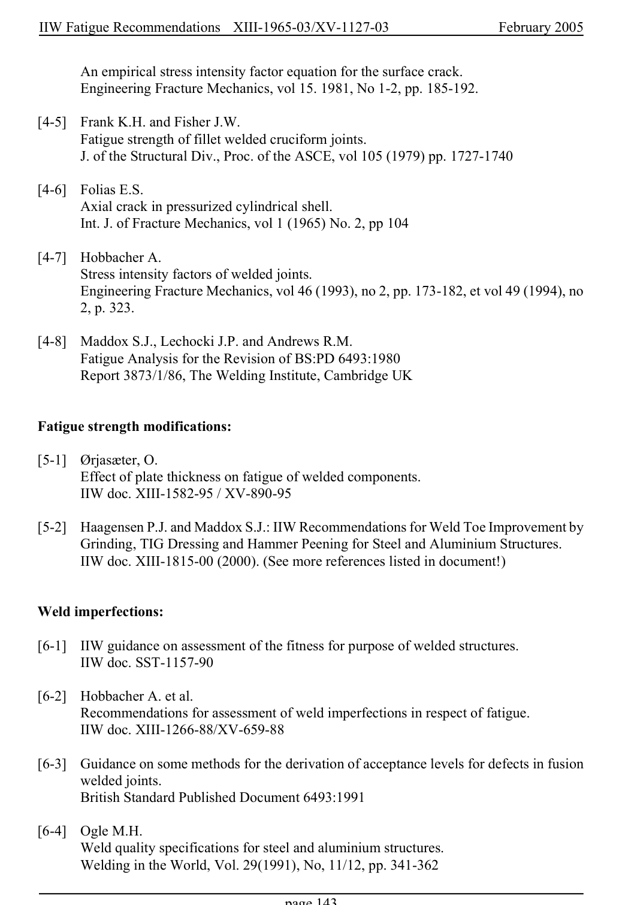

# 6 — Appendices — pagina PDF 143

Fonte: [IIW — Recommendations for Fatigue Design of Welded Joints and Components](../../sources/iiw.pdf#page=143). Pagina stampata: 143.

> Formule, simboli e associazioni delle tabelle non sono convalidati per il calcolo.

## Testo estratto

IIW Fatigue Recommendations  XIII-1965-03/XV-1127-03                 February 2005

An empirical stress intensity factor equation for the surface crack. Engineering Fracture Mechanics, vol 15. 1981, No 1-2, pp. 185-192.

```text
[4-5]  Frank K.H. and Fisher J.W.
       Fatigue strength of fillet welded cruciform joints.
         J. of the Structural Div., Proc. of the ASCE, vol 105 (1979) pp. 1727-1740
```

```text
[4-6]  Folias E.S.
       Axial crack in pressurized cylindrical shell.
         Int. J. of Fracture Mechanics, vol 1 (1965) No. 2, pp 104
```

```text
[4-7]  Hobbacher A.
       Stress intensity factors of welded joints.
       Engineering Fracture Mechanics, vol 46 (1993), no 2, pp. 173-182, et vol 49 (1994), no
        2, p. 323.
```

```text
[4-8]  Maddox S.J., Lechocki J.P. and Andrews R.M.
       Fatigue Analysis for the Revision of BS:PD 6493:1980
      Report 3873/1/86, The Welding Institute, Cambridge UK
```

Fatigue strength modifications:

```text
[5-1]  Ørjasæter, O.
       Effect of plate thickness on fatigue of welded components.
     IIW doc. XIII-1582-95 / XV-890-95
```

```text
[5-2]  Haagensen P.J. and Maddox S.J.: IIW Recommendations for Weld Toe Improvement by
       Grinding, TIG Dressing and Hammer Peening for Steel and Aluminium Structures.
     IIW doc. XIII-1815-00 (2000). (See more references listed in document!)
```

Weld imperfections:

[6-1]  IIW guidance on assessment of the fitness for purpose of welded structures. IIW doc. SST-1157-90

```text
[6-2]  Hobbacher A. et al.
      Recommendations for assessment of weld imperfections in respect of fatigue.
     IIW doc. XIII-1266-88/XV-659-88
```

```text
[6-3]  Guidance on some methods for the derivation of acceptance levels for defects in fusion
      welded joints.
        British Standard Published Document 6493:1991
```

```text
[6-4]  Ogle M.H.
     Weld quality specifications for steel and aluminium structures.
      Welding in the World, Vol. 29(1991), No, 11/12, pp. 341-362
```

page 143

## Pagina di riscontro


