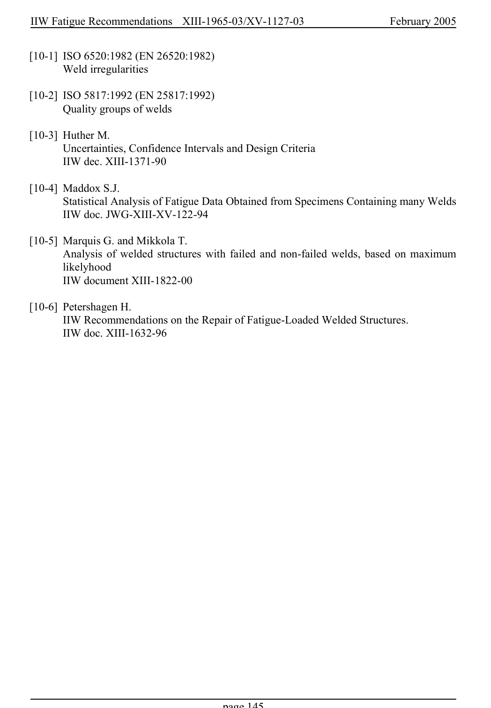

# 6 — Appendices — pagina PDF 145

Fonte: [IIW — Recommendations for Fatigue Design of Welded Joints and Components](../../sources/iiw.pdf#page=145). Pagina stampata: 145.

> Formule, simboli e associazioni delle tabelle non sono convalidati per il calcolo.

## Testo estratto

IIW Fatigue Recommendations  XIII-1965-03/XV-1127-03                 February 2005

[10-1] ISO 6520:1982 (EN 26520:1982) Weld irregularities

[10-2] ISO 5817:1992 (EN 25817:1992) Quality groups of welds

```text
[10-3] Huther M.
       Uncertainties, Confidence Intervals and Design Criteria
     IIW dec. XIII-1371-90
```

[10-4] Maddox S.J. Statistical Analysis of Fatigue Data Obtained from Specimens Containing many Welds IIW doc. JWG-XIII-XV-122-94

[10-5] Marquis G. and Mikkola T. Analysis of welded structures with failed and non-failed welds, based on maximum likelyhood IIW document XIII-1822-00

```text
[10-6] Petershagen H.
     IIW Recommendations on the Repair of Fatigue-Loaded Welded Structures.
     IIW doc. XIII-1632-96
```

page 145

## Pagina di riscontro


