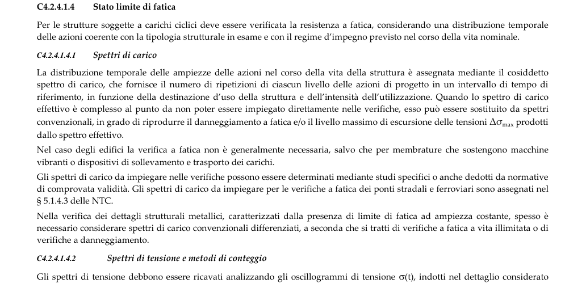

# C4.2.4.1.4 — Stato limite di fatica — pagina PDF 123

Fonte: [Circolare 21 gennaio 2019, n. 7 — sezioni sulla fatica](../../sources/ntc.pdf#page=123). Pagina stampata: 119.

> Formule, simboli e associazioni delle tabelle non sono convalidati per il calcolo. Testo ottenuto con OCR; verificare simboli greci, apici, pedici e disuguaglianze sulla pagina.

## Testo estratto

```text
C4.2.4.1.4
Stato limite di fatica
Per le strutture soggette a carichi ciclici deve essere verificata la resistenza a fatica, considerando una distribuzione temporale
delle azioni coerente con la tipologia strutturale in esame e con il regime d’impegno previsto nel corso della vita nominale.
C4.2.4.1.4.1 Spettri di carico
La distribuzione temporale delle ampiezze delle azioni nel corso della vita della struttura è assegnata mediante il cosiddetto
spettro di carico, che fornisce il numero di ripetizioni di ciascun livello delle azioni di progetto in un intervallo di tempo di
riferimento, in funzione della destinazione d’uso della struttura e dell'intensità dell'utilizzazione. Quando lo spettro di carico
effettivo è complesso al punto da non poter essere impiegato direttamente nelle verifiche, esso può essere sostituito da spettri
nno   ns  se      e  n    on de ott
dallo spettro effettivo.
Nel caso degli edifici la verifica a fatica non è generalmente necessaria, salvo che per membrature che sostengono macchine
vibranti o dispositivi di sollevamento e trasporto dei carichi.
Gli spettri di carico da impiegare nelle verifiche possono essere determinati mediante studi specifici o anche dedotti da normative
d t sos t  s   aot   e d   t  ds   a ie
§ 5.1.4.3 delle NTC.
Nella verifica dei dettagli strutturali metallici, caratterizzati dalla presenza di limite di fatica ad ampiezza costante, spesso è
necessario considerare spettri di carico convenzionali differenziati, a seconda che si tratti di verifiche a fatica a vita illimitata o di
verifiche a danneggiamento.
C4.2.4.1.4.2
Spettri di tensione e metodi di conteggio
Gli spettri di tensione debbono essere ricavati analizzando gli oscillogrammi di tensione σ(t), indotti nel dettaglio considerato
```

## Pagina di riscontro


