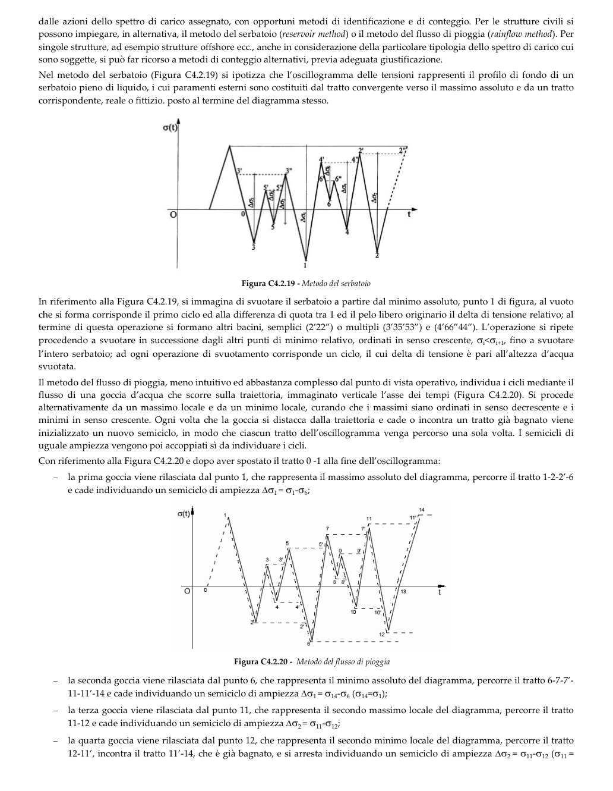

# C4.2.4.1.4 — Stato limite di fatica — pagina PDF 124

Fonte: [Circolare 21 gennaio 2019, n. 7 — sezioni sulla fatica](../../sources/ntc.pdf#page=124). Pagina stampata: 120.

> Formule, simboli e associazioni delle tabelle non sono convalidati per il calcolo. Testo ottenuto con OCR; verificare simboli greci, apici, pedici e disuguaglianze sulla pagina.

## Testo estratto

```text
dalle azioni dello spettro di carico assegnato, con opportuni metodi di identificazione e di conteggio. Per le strutture civili si
possono impiegare, in alternativa, il metodo del serbatoio (reservoir method) o il metodo del flusso di pioggia (rainflow method). Per
singole strutture, ad esempio strutture offshore ecc., anche in considerazione della particolare tipologia dello spettro di carico cui
sono soggette, si può far ricorso a metodi di conteggio alternativi, previa adeguata giustificazione.
Nel metodo del serbatoio (Figura C4.2.19) si ipotizza che l’oscillogramma delle tensioni rappresenti il profilo di fondo di un
serbatoio pieno di liquido, i cui paramenti esterni sono costituiti dal tratto convergente verso il massimo assoluto e da un tratto
corrispondente, reale o fittizio. posto al termine del diagramma stesso.
σ(t)
6"
Δσ4
ΔO2
Δσ
O
0
t
Figura C4.2.19 - Metodo del serbatoio
In riferimento alla Figura C4.2.19, si immagina di svuotare il serbatoio a partire dal minimo assoluto, punto 1 di figura, al vuoto
che si forma corrisponde il primo ciclo ed alla differenza di quota tra 1 ed il pelo libero originario il delta di tensione relativo; al
termine di questa operazione si formano altri bacini, semplici (2′22") o multipli (3'35′53") e (4'66"44"). L'operazione si ripete
procedendo a svuotare in successione dagli altri punti di minimo relativo, ordinati in senso crescente, σ<σ+1, fino a svuotare
l'intero serbatoio; ad ogni operazione di svuotamento corrisponde un ciclo, il cui delta di tensione è pari all'altezza d’acqua
svuotata.
Il metodo del flusso di pioggia, meno intuitivo ed abbastanza complesso dal punto di vista operativo, individua i cicli mediante il
id  ( u   us, ue e  s ucs  u, d   usedoe
mn  o s msso   mn  o n   n sso   e
minimi in senso crescente. Ogni volta che la goccia si distacca dalla traiettoria e cade o incontra un tratto già bagnato viene
inizializzato un nuovo semiciclo, in modo che ciascun tratto dell'oscillogramma venga percorso una sola volta. I semicicli di
uguale ampiezza vengono poi accoppiati sì da individuare i cicli.
Con riferimento alla Figura C4.2.20 e dopo aver spostato il tratto 0 -1 alla fine dell'oscillogramma:
la prima goccia viene rilasciata dal punto 1, che rappresenta il massimo assoluto del diagramma, percorre il tratto 1-2-2'-6
e cade individuando un semiciclo di ampiezza ∆σ1= σ1-σ6;
σ(t)
14
11
11
5
ε
3'
O
0
13
t
4
4
10
10
2
12
Figura C4.2.20 - Metodo del flusso di pioggia
la seconda goccia viene rilasciata dal punto 6, che rappresenta il minimo assoluto del diagramma, percorre il tratto 6-7-7′-
11-11′-14 e cade individuando un semiciclo di ampiezza ∆σ1 = σ14-σ6 (σ14=σ1);
la terza goccia viene rilasciata dal punto 11, che rappresenta il secondo massimo locale del diagramma, percorre il tratto
11-12 e cade individuando un semiciclo di ampiezza ∆σ2= σ11-σ12;
la quarta goccia viene rilasciata dal punto 12, che rappresenta il secondo minimo locale del diagramma, percorre il tratto
12-11′, incontra il tratto 11′-14, che è già bagnato, e si arresta individuando un semiciclo di ampiezza ∆σ2 = σ11-σ12 (σ11 =
```

## Pagina di riscontro


