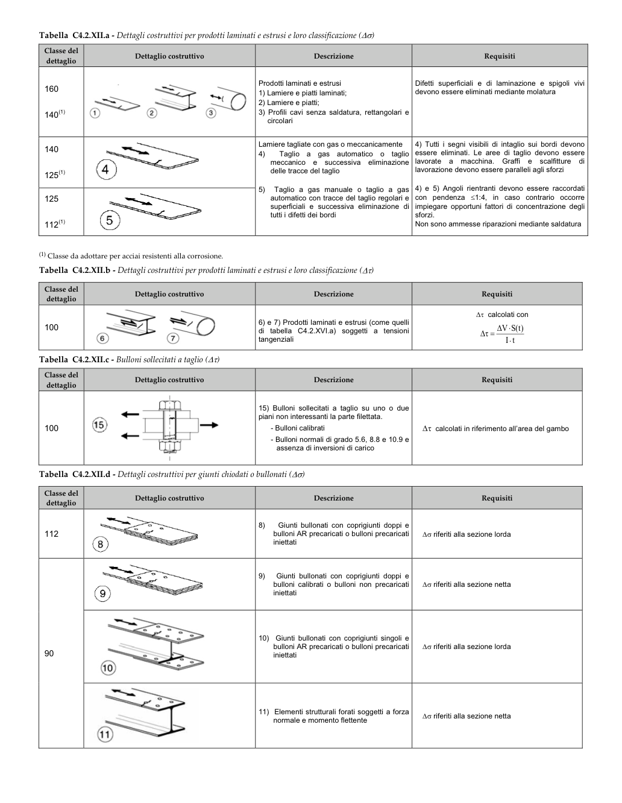

# C4.2.4.1.4 — Stato limite di fatica — pagina PDF 127

Fonte: [Circolare 21 gennaio 2019, n. 7 — sezioni sulla fatica](../../sources/ntc.pdf#page=127). Pagina stampata: 123.

> Formule, simboli e associazioni delle tabelle non sono convalidati per il calcolo. Testo ottenuto con OCR; verificare simboli greci, apici, pedici e disuguaglianze sulla pagina.

## Testo estratto

```text
Tabella C4.2.XII.a - Dettagli costruttivi per prodotti laminati e estrusi e loro classificazione (∆σ)
Classe del
Dettaglio costruttivo
Descrizione
Requisiti
dettaglio
Prodotti laminati e estrusi
Difetti superficiali e di laminazione e spigoli vivi
160
1) Lamiere e piatti laminati;
devono essere eliminati mediante molatura
2) Lamiere e piatti;
140(1)
3) Profili cavi senza saldatura, rettangolari e
circolari
Lamiere tagliate con gas o meccanicamente
4) Tutti i segni visibili di intaglio sui bordi devono
140
4)
Taglio a gas automatico o taglio
essere eliminati. Le aree di taglio devono essere
meccanico e successiva eliminazione
lavorate a macchina. Graffi e scalfitture di
125(1)
4
delle tracce del taglio
lavorazione devono essere paralleli agli sforzi
5) Taglio a gas manuale o taglio a gas
4) e 5) Angoli rientranti devono essere raccordati
125
automatico con tracce del taglio regolari e
con pendenza ≤1:4, in caso contrario occorre
superficiali e successiva eliminazione di
impiegare opportuni fattori di concentrazione degli
5
tutti i difetti dei bordi
sforzi.
112(1)
Non sono ammesse riparazioni mediante saldatura
(1) Classe da adottare per acciai resistenti alla corrosione.
Tabella C4.2.XII.b - Dettagli costruttivi per prodotti laminati e estrusi e loro classificazione (∆τ)
Classe del
Dettaglio costruttivo
Requisiti
dettaglio
Descrizione
Δτ calcolati con
6) e 7) Prodotti laminati e estrusi (come quelli
100
di tabella C4.2.XVI.a) soggetti a tensioni
∆V·S(t)
∆τ =
tangenziali
I·t
Tabella C4.2.XII.c - Bulloni sollecitati a taglio (∆τ)
Classe del
dettaglio
Dettaglio costruttivo
Descrizione
Requisiti
15) Bulloni sollecitati a taglio su uno o due
piani non interessanti la parte filettata.
100
- Bulloni calibrati
∆τ calcolati in riferimento all'area del gambo
- Bulloni normali di grado 5.6, 8.8 e 10.9 e
assenza di inversioni di carico
Tabella C4.2.XII.d - Dettagli costruttivi per giunti chiodati o bullonati (∆σ)
Classe del
Dettaglio costruttivo
Descrizione
Requisiti
dettaglio
Giunti bullonati con coprigiunti doppi e
8)
112
bulloni AR precaricati o bulloni precaricati
∆σ riferiti alla sezione lorda
iniettati
8
9)
Giunti bullonati con coprigiunti doppi e
bulloni calibrati o bulloni non precaricati
∆σ riferiti alla sezione netta
9
iniettati
10) Giunti bullonati con coprigiunti singoli e
90
bulloni AR precaricati o bulloni precaricati
∆σ riferiti alla sezione lorda
iniettati
10
11) Elementi strutturali forati soggetti a forza
∆σ riferiti alla sezione netta
normale e momento flettente
11
```

## Tabelle e dettagli

- [ntc-127-t01-d01-01](../details/ntc-127-t01-d01-01.md) — 160; 140(1)
- [ntc-127-t01-d01-02](../details/ntc-127-t01-d01-02.md) — 160; 140(1)
- [ntc-127-t01-d01-03](../details/ntc-127-t01-d01-03.md) — 160; 140(1)
- [ntc-127-t01-d02](../details/ntc-127-t01-d02.md) — 140; 125(1)
- [ntc-127-t01-d03](../details/ntc-127-t01-d03.md) — 125; 112(1)
- [ntc-127-t02-d01-01](../details/ntc-127-t02-d01-01.md) — 100
- [ntc-127-t02-d01-02](../details/ntc-127-t02-d01-02.md) — 100
- [ntc-127-t03-d01](../details/ntc-127-t03-d01.md) — 100
- [ntc-127-t04-d01](../details/ntc-127-t04-d01.md) — 112
- [ntc-127-t04-d02](../details/ntc-127-t04-d02.md) — 90
- [ntc-127-t04-d03](../details/ntc-127-t04-d03.md) — 90
- [ntc-127-t04-d04](../details/ntc-127-t04-d04.md) — 90

## Pagina di riscontro


