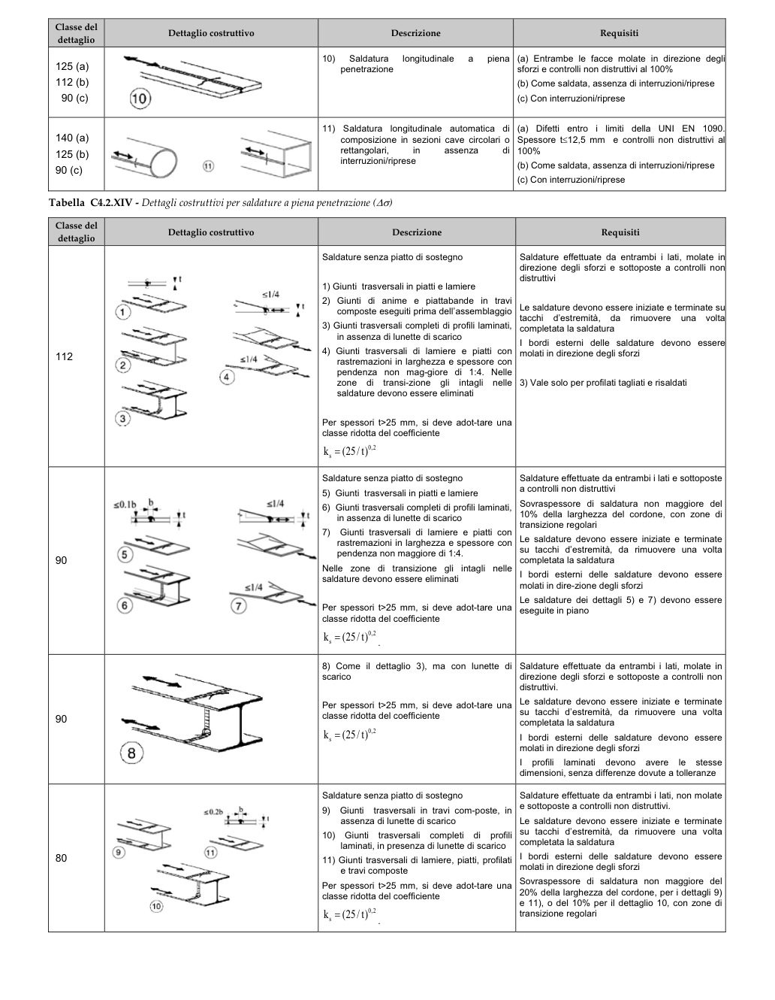

# C4.2.4.1.4 — Stato limite di fatica — pagina PDF 129

Fonte: [Circolare 21 gennaio 2019, n. 7 — sezioni sulla fatica](../../sources/ntc.pdf#page=129). Pagina stampata: 125.

> Formule, simboli e associazioni delle tabelle non sono convalidati per il calcolo. Testo ottenuto con OCR; verificare simboli greci, apici, pedici e disuguaglianze sulla pagina.

## Testo estratto

Classe del dettaglio Dettaglio costruttivo Descrizione Requisiti 10) Saldatura longitudinale a piena (a) Entrambe le facce molate in direzione deglil 125 (a) penetrazione sforzi e controlli non distruttivi al 100% 112 (b) (b) Come saldata, assenza di interruzioni/riprese 90 (c) (c) Con interruzioni/riprese 11) Saldatura longitudinale automaticadi (a) Difetti entro i limiti della UNI EN 1090. 140 (a) composizione in sezioni cave circolari o Spessore t≤12,5 mm e controlli non distruttivi al 125 (b) rettangolari, in assenza !p 100% interruzioni/riprese 90 (c) (b) Come saldata, assenza di interruzioni/riprese (c) Con interruzioni/riprese Tabella C4.2.XIV - Dettagli costruttivi per saldature a piena penetrazione (∆σ) Classe del Dettaglio costruttivo Descrizione Requisiti dettaglio Saldature senza piatto di sostegno Saldature effettuate da entrambi i lati, molate in| direzione degli sforzi e sottoposte a controlli non distruttivi 1) Giunti trasversali in piatti e lamiere ≤1/4 2) Giunti di anime e piattabande in travi composte eseguiti prima dell'assemblaggio Le saldature devono essere iniziate e terminate su tacchi d'estremità, da rimuovere una voltal 3) Giunti trasversali completi di profili laminati, completata la saldatura in assenza di lunette di scarico I bordi esterni delle saldature devono essere 112 4) Giunti trasversali di lamiere e piatti con molati in direzione degli sforzi ≤1/4 rastremazioni in larghezza e spessore con pendenza non mag-giore di 1:4. Nelle zone di transi-zione gli intagli nelle 3) Vale solo per profilati tagliati e risaldati saldature devono essere eliminati 3 Per spessori t>25 mm, si deve adot-tare una classe ridotta del coefficiente k = (25/t)0,2 Saldature senza piatto di sostegno Saldature effettuate da entrambi i lati e sottoposte 5) Giunti trasversali in piatti e lamiere a controlli non distruttivi ≤0.1b ≤1/4 6) Giunti trasversali completi di profili laminati, Sovraspessore di saldatura non maggiore del 10% della larghezza del cordone, con zone di in assenza di lunette di scarico Giunti trasversali di lamiere e piatti con transizione regolari 7) Le saldature devono essere iniziate e terminate rastremazioni in larghezza e spessore con pendenza non maggiore di 1:4. su tacchi d’estremità, da rimuovere una volta 90 completata la saldatura Nelle zone di transizione gli intagli nelle I bordi esterni delle saldature devono essere saldature devono essere eliminati ≤1/4 molati in dire-zione degli sforzi Le saldature dei dettagli 5) e 7) devono essere Per spessori t>25 mm, si deve adot-tare una eseguite in piano classe ridotta del coefficiente ks = (25/t)0,2 8) Come il dettaglio 3), ma con lunette di Saldature effettuate da entrambi i lati, molate in scarico direzione degli sforzi e sottoposte a controlli non distruttivi. Per spessori t>25 mm, si deve adot-tare una Le saldature devono essere iniziate e terminate su tacchi d'estremità, da rimuovere una volta 90 classe ridotta del coefficiente completata la saldatura k = (25/t)0,.2 I bordi esterni delle saldature devono essere 8 molati in direzione degli sforzi I profili laminati devono avere le stesse dimensioni, senza differenze dovute a tolleranze Saldature senza piatto di sostegno Saldature effettuate da entrambi i lati, non molate (6 Giunti trasversali in travi com-poste, in e sottoposte a controlli non distruttivi. ≤0.2b assenza di lunette di scarico Le saldature devono essere iniziate e terminate 10) Giunti trasversali completi di profili su tacchi d’estremità, da rimuovere una volta completata la saldatura laminati, in presenza di lunette di scarico 80 I bordi esterni delle saldature devono essere 11) Giunti trasversali di lamiere, piatti, profilati e travi composte molati in direzione degli sforzi Per spessori t>25 mm, si deve adot-tare una Sovraspessore di saldatura non maggiore del 20% della larghezza del cordone, per i dettagli 9) classe ridotta del coefficiente e 11), o del 10% per il dettaglio 10, con zoñe di ks = (25/t)0,2 transizione regolari

## Tabelle e dettagli

- [ntc-129-t01-d01](../details/ntc-129-t01-d01.md) — 125 (a); 112 (b); 90 (c)
- [ntc-129-t01-d02](../details/ntc-129-t01-d02.md) — 140 (a); 125 (b); 90 (c)
- [ntc-129-t02-d01-01](../details/ntc-129-t02-d01-01.md) — 112
- [ntc-129-t02-d01-02](../details/ntc-129-t02-d01-02.md) — 112
- [ntc-129-t02-d01-03](../details/ntc-129-t02-d01-03.md) — 112
- [ntc-129-t02-d01-04](../details/ntc-129-t02-d01-04.md) — 112
- [ntc-129-t02-d02-01](../details/ntc-129-t02-d02-01.md) — 90
- [ntc-129-t02-d02-02](../details/ntc-129-t02-d02-02.md) — 90
- [ntc-129-t02-d02-03](../details/ntc-129-t02-d02-03.md) — 90
- [ntc-129-t02-d03-01](../details/ntc-129-t02-d03-01.md) — 80
- [ntc-129-t02-d03-02](../details/ntc-129-t02-d03-02.md) — 80
- [ntc-129-t02-d03-03](../details/ntc-129-t02-d03-03.md) — 80
- [ntc-129-t02-d04](../details/ntc-129-t02-d04.md) — 90

## Pagina di riscontro

