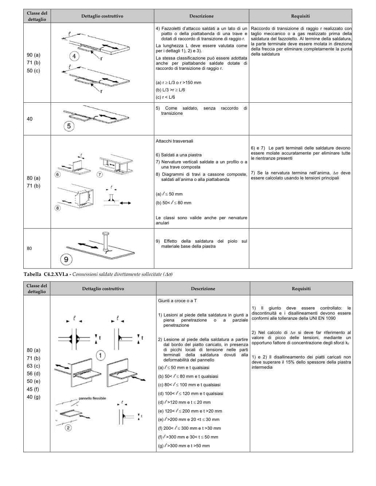

# C4.2.4.1.4 — Stato limite di fatica — pagina PDF 131

Fonte: [Circolare 21 gennaio 2019, n. 7 — sezioni sulla fatica](../../sources/ntc.pdf#page=131). Pagina stampata: 127.

> Formule, simboli e associazioni delle tabelle non sono convalidati per il calcolo. Testo ottenuto con OCR; verificare simboli greci, apici, pedici e disuguaglianze sulla pagina.

## Testo estratto

```text
Classe del
dettaglio
Dettaglio costruttivo
Descrizione
Requisiti
4) Fazzoletti d’attacco saldati a un lato di un
Raccordo di transizione di raggio r realizzato con
piatto o della piattabanda di una trave e
taglio meccanico o a gas realizzato prima della
dotati di raccordo di transizione di raggio r.
saldatura del fazzoletto. Al termine della saldatura,
la parte terminale deve essere molata in direzione
La lunghezza L deve essere valutata come
per i dettagli 1), 2) e 3).
deila freccia per eliminare completamente la puntal
90 (a)
4
della saldatura
La stessa classificazione può essere adottata
71 (b)
anche per piattabande saldate dotate di
50 (c)
raccordo di transizione di raggio r.
(a) r ≥ L/3 o r >150 mm
(b) L/3 >r ≥ L/6
(c) r < L/6
5) Come saldato,
senza
raccordo
di
transizione
40
5
Attacchi trasversali
6) e 7) Le parti terminali delle saldature devono
6) Saldati a una piastra
essere molate accuratamente per eliminare tutte
le rientranze presenti
7) Nervature verticali saldate a un profilo o a
una trave composta
8) Diagrammi di travi a cassone composte,
7) Se la nervatura termina nell'anima, ∆σ deve
80 (a)
saldati all'anima o alla piattabanda
essere calcolato usando le tensioni principali
71 (b)
(a) l≤ 50 mm
(b) 50< l≤ 80 mm
Le classi sono valide anche per nervature
anulari
9) Effetto della saldatura del piolo sul
materiale base della piastra
80
9
Tabella C4.2.XVI.a - Connessioni saldate direttamente sollecitate (∆σ)
Classe del
dettaglio
Dettaglio costruttivo
Descrizione
Requisiti
Giunti a croce o a T
1) II giunto deve essere controllato: le
discontinuità e i disallineamenti devono essere
1) Lesioni al piede della saldatura in giunti a
piena penetrazione o a
parziale
conformi alle tolleranze della UNI EN 1090
penetrazione
2) Nel calcolo di ∆σ si deve far riferimento al
2) Lesione al piede della saldatura a partire
valore di picco delle tensioni, mediante un
opportuno fattore di concentrazione degli sforzi k
dal bordo del piatto caricato, in presenza
80 (a)
di picchi locali di tensione nelle parti
71 (b)
terminali della saldatura dovuti alla
1) e 2) Il disallineamento dei piatti caricati non
deformabilità del pannello
63 (c)
deve superare il 15% dello spessore della piastra
(a) θ ≤ 50 mm e t qualsiasi
intermedia
56 (d)
(b) 50< l≤ 80 mm e t qualsiasi
50 (e)
(c) 80< l ≤ 100 mm e t qualsiasi
45 (f)
(d) 100< l ≤ 120 mm e t qualsiasi
40 (g)
pannello flessibile
(d) l>120 mm e t ≤ 20 mm
(e) 120< l ≤ 200 mm e t >20 mm
(e) l>200 mm e 20 <t ≤ 30 mm
(f) 200< l ≤ 300 mm e t >30 mm
(f) l>300 mm e 30< t ≤ 50 mm
(g) l>300 mm e t >50 mm
```

## Tabelle e dettagli

- [ntc-131-t01-d01](../details/ntc-131-t01-d01.md) — 80
- [ntc-131-t01-d02](../details/ntc-131-t01-d02.md) — 90 (a); 71 (b); 50 (c)
- [ntc-131-t01-d03](../details/ntc-131-t01-d03.md) — 40
- [ntc-131-t01-d04-01](../details/ntc-131-t01-d04-01.md) — 80 (a); 71 (b)
- [ntc-131-t01-d04-02](../details/ntc-131-t01-d04-02.md) — 80 (a); 71 (b)
- [ntc-131-t01-d04-03](../details/ntc-131-t01-d04-03.md) — 80 (a); 71 (b)
- [ntc-131-t02-d01](../details/ntc-131-t02-d01.md) — 80 (a); 71 (b); 63 (c); 56 (d); 50 (e); 45 (f); 40 (g)
- [ntc-131-t02-d02](../details/ntc-131-t02-d02.md) — 80 (a); 71 (b); 63 (c); 56 (d); 50 (e); 45 (f); 40 (g)

## Pagina di riscontro


