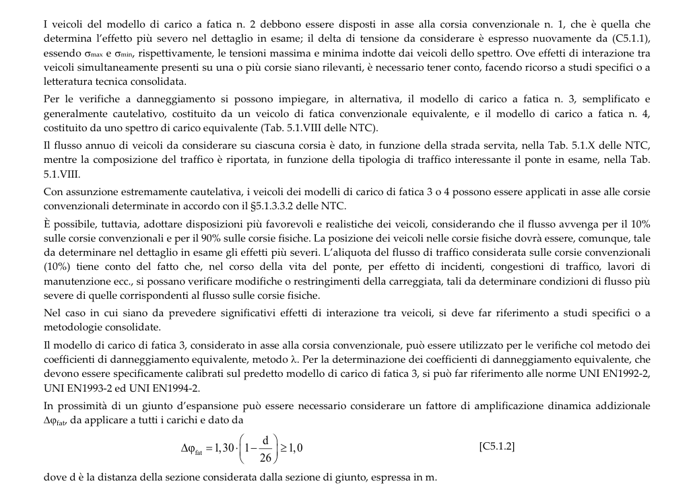

# C5.1.4.3 — Fatica dei ponti stradali — pagina PDF 172

Fonte: [Circolare 21 gennaio 2019, n. 7 — sezioni sulla fatica](../../sources/ntc.pdf#page=172). Pagina stampata: 168.

> Formule, simboli e associazioni delle tabelle non sono convalidati per il calcolo. Testo ottenuto con OCR; verificare simboli greci, apici, pedici e disuguaglianze sulla pagina.

## Testo estratto

```text
I veicoli del modello di carico a fatica n. 2 debbono essere disposti in asse alla corsia convenzionale n. 1, che è quella che
determina l’effetto più severo nel dettaglio in esame; il delta di tensione da considerare è espresso nuovamente da (C5.1.1),
essendo σmax e σmin, rispettivamente, le tensioni massima e minima indotte dai veicoli dello spettro. Ove effetti di interazione tra
veicoli simultaneamente presenti su una o più corsie siano rilevanti, è necessario tener conto, facendo ricorso a studi specifici o a
letteratura tecnica consolidata.
a os ' n at    o  'a  aor ssod  og    dto
generalmente cautelativo, costituito da un veicolo di fatica convenzionale equivalente, e il modello di carico a fatica n. 4,
costituito da uno spettro di carico equivalente (Tab. 5.1.VIII delle NTC).
Il flusso annuo di veicoli da considerare su ciascuna corsia è dato, in funzione della strada servita, nella Tab. 5.1.X delle NTC,
eae e  e od e    e   e i  mi  no  no
5.1.VIII.
Con assunzione estremamente cautelativa, i veicoli dei modelli di carico di fatica 3 o 4 possono essere applicati in asse alle corsie
convenzionali determinate in accordo con il §5.1.3.3.2 delle NTC.
È possibile, tuttavia, adottare disposizioni più favorevoli e realistiche dei veicoli, considerando che il flusso avvenga per il 10%
sulle corsie convenzionali e per il 90% sulle corsie fisiche. La posizione dei veicoli nelle corsie fisiche dovrà essere, comunque, tale
da determinare nel dettaglio in esame gli effetti più severi. L’aliquota del flusso di traffico considerata sulle corsie convenzionali
(10%) tiene conto del fatto che, nel corso della vita del ponte, per effetto di incidenti, congestioni di traffico, lavori di
manutenzione ecc., si possano verificare modifiche o restringimenti della carreggiata, tali da determinare condizioni di flusso più
severe di quelle corrispondenti al flusso sulle corsie fisiche.
d   i s     i    reo  s
metodologie consolidate.
Il modello di carico di fatica 3, considerato in asse alla corsia convenzionale, può essere utilizzato per le verifiche col metodo dei
coefficienti di danneggiamento equivalente, metodo λ. Per la determinazione dei coefficienti di danneggiamento equivalente, che
devono essere specificamente calibrati sul predetto modello di carico di fatica 3, si può far riferimento alle norme UNI EN1992-2,
UNI EN1993-2 ed UNI EN1994-2.
In prossimità di un giunto d’espansione può essere necessario considerare un fattore di amplificazione dinamica addizionale
∆φfat, da applicare a tutti i carichi e dato da
d
∆φfat = 1,30. 1-
≥1,0
[C5.1.2]
26
dove d è la distanza della sezione considerata dalla sezione di giunto, espressa in m.
```

## Pagina di riscontro


