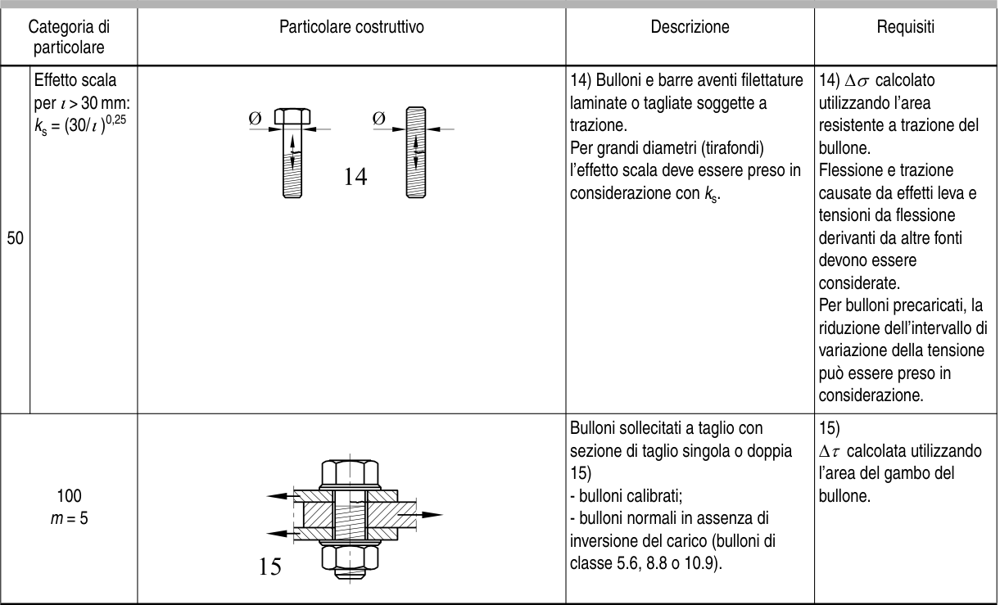

# EC3 — Tabella 8.1

[Pagina PDF 24](../pages/ec3-024.md)

## Celle estratte

| Rettangolo (punti PDF) | Testo della cella |
| --- | --- |
| [42.63, 76.08, 109.93, 80.1] |  |
| [42.63, 80.1, 109.93, 108.09] | Categoria di  particolare |
| [42.63, 108.09, 56.9, 278.13] | 50 |
| [42.63, 278.13, 109.93, 371.35] | 100 m = 5 |
| [56.9, 108.09, 109.93, 278.13] | Effetto scala per ι> 30 mm: ks = (30/ι)0,25 |
| [109.93, 76.08, 318.81, 80.1] |  |
| [109.93, 80.1, 318.81, 108.09] | Particolare costruttivo |
| [109.93, 108.09, 318.81, 278.13] |  |
| [109.93, 278.13, 318.81, 371.35] |  |
| [318.81, 76.08, 440.88, 80.1] |  |
| [318.81, 80.1, 440.88, 108.09] | Descrizione |
| [318.81, 108.09, 440.88, 278.13] | 14) Bulloni e barre aventi filettature laminate o tagliate soggette a trazione. Per grandi diametri (tirafondi) l’effetto scala deve essere preso in considerazione con ks. |
| [318.81, 278.13, 440.88, 371.35] | Bulloni sollecitati a taglio con sezione di taglio singola o doppia 15) - bulloni calibrati; - bulloni normali in assenza di inversione del carico (bulloni di classe 5.6, 8.8 o 10.9). |
| [440.88, 76.08, 530.45, 80.1] |  |
| [440.88, 80.1, 530.45, 108.09] | Requisiti |
| [440.88, 108.09, 530.45, 278.13] | 14) ∆σ calcolato utilizzando l’area resistente a trazione del bullone. Flessione e trazione causate da effetti leva e tensioni da flessione derivanti da altre fonti devono essere considerate. Per bulloni precaricati, la riduzione dell’intervallo di variazione della tensione può essere preso in considerazione. |
| [440.88, 278.13, 530.45, 371.35] | 15) ∆τ calcolata utilizzando l’area del gambo del bullone. |
