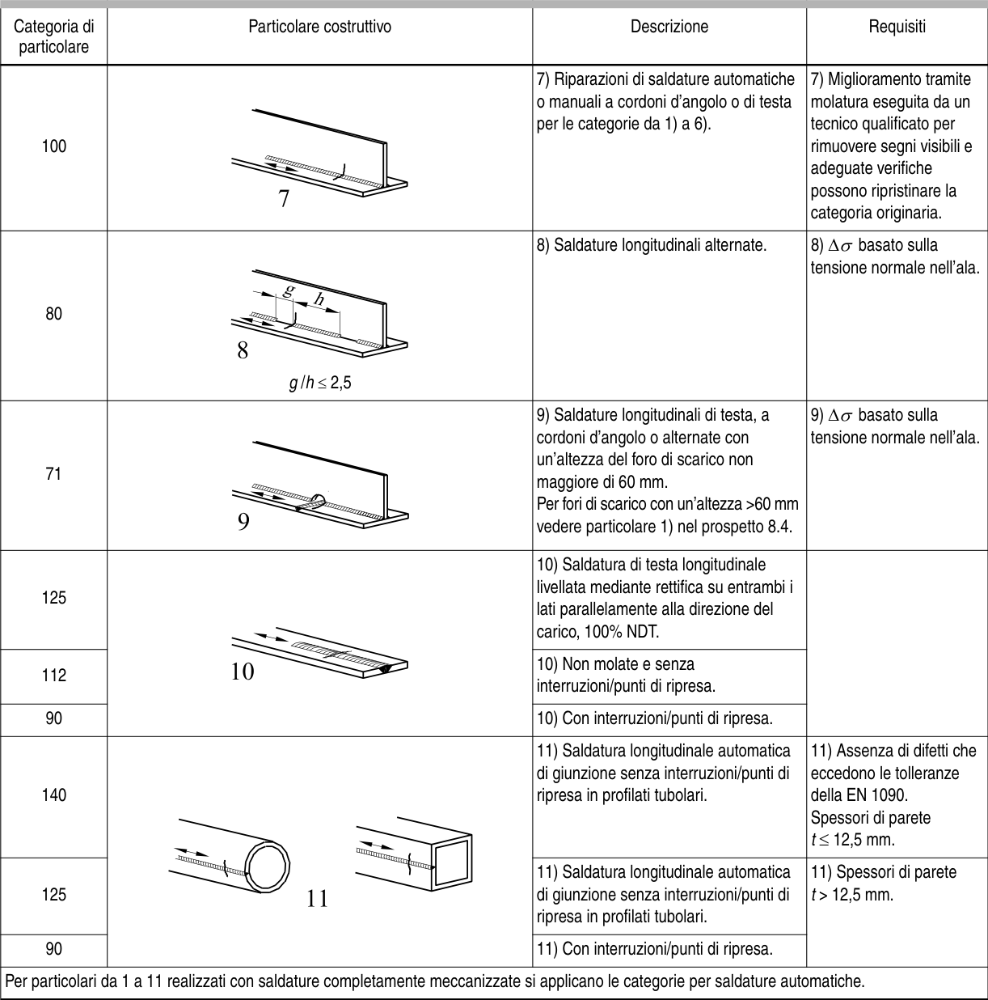

# EC3 — Tabella 8.2

[Pagina PDF 25](../pages/ec3-025.md)

## Celle estratte

| Rettangolo (punti PDF) | Testo della cella |
| --- | --- |
| [65.39, 76.08, 118.29, 80.1] |  |
| [65.39, 80.1, 118.29, 108.09] | Categoria di  particolare |
| [65.39, 108.09, 118.29, 190.11] | 100 |
| [65.39, 190.11, 118.29, 274.11] | 80 |
| [65.39, 274.11, 118.29, 348.15] | 71 |
| [65.39, 348.15, 118.29, 398.18] | 125 |
| [65.39, 398.18, 118.29, 424.11] | 112 |
| [65.39, 424.11, 118.29, 440.13] | 90 |
| [65.39, 440.13, 118.29, 500.13] | 140 |
| [65.39, 500.13, 118.29, 538.11] | 125 |
| [65.39, 538.11, 118.29, 554.13] | 90 |
| [65.39, 554.13, 553.84, 570.15] | Per particolari da 1 a 11 realizzati con saldature completamente meccanizzate si applicano le categorie per saldature automatiche. |
| [118.29, 76.08, 328.77, 80.1] |  |
| [118.29, 80.1, 328.77, 108.09] | Particolare costruttivo |
| [118.29, 108.09, 328.77, 190.11] |  |
| [118.29, 190.11, 328.77, 274.11] | g /h ≤ 2,5 |
| [118.29, 274.11, 328.77, 348.15] |  |
| [118.29, 348.15, 328.77, 440.13] |  |
| [118.29, 440.13, 328.77, 554.13] |  |
| [328.77, 76.08, 464.31, 80.1] |  |
| [328.77, 80.1, 464.31, 108.09] | Descrizione |
| [328.77, 108.09, 464.31, 190.11] | 7) Riparazioni di saldature automatiche o manuali a cordoni d’angolo o di testa per le categorie da 1) a 6). |
| [328.77, 190.11, 464.31, 274.11] | 8) Saldature longitudinali alternate. |
| [328.77, 274.11, 464.31, 348.15] | 9) Saldature longitudinali di testa, a cordoni d’angolo o alternate con un’altezza del foro di scarico non maggiore di 60 mm. Per fori di scarico con un’altezza >60 mm vedere particolare 1) nel prospetto 8.4. |
| [328.77, 348.15, 464.31, 398.18] | 10) Saldatura di testa longitudinale livellata mediante rettifica su entrambi i lati parallelamente alla direzione del carico, 100% NDT. |
| [328.77, 398.18, 464.31, 424.11] | 10) Non molate e senza interruzioni/punti di ripresa. |
| [328.77, 424.11, 464.31, 440.13] | 10) Con interruzioni/punti di ripresa. |
| [328.77, 440.13, 464.31, 500.13] | 11) Saldatura longitudinale automatica di giunzione senza interruzioni/punti di ripresa in profilati tubolari. |
| [328.77, 500.13, 464.31, 538.11] | 11) Saldatura longitudinale automatica di giunzione senza interruzioni/punti di ripresa in profilati tubolari. |
| [328.77, 538.11, 464.31, 554.13] | 11) Con interruzioni/punti di ripresa. |
| [464.31, 76.08, 553.84, 80.1] |  |
| [464.31, 80.1, 553.84, 108.09] | Requisiti |
| [464.31, 108.09, 553.84, 190.11] | 7) Miglioramento tramite molatura eseguita da un tecnico qualificato per rimuovere segni visibili e adeguate verifiche possono ripristinare la categoria originaria. |
| [464.31, 190.11, 553.84, 274.11] | 8) ∆σ basato sulla tensione normale nell’ala. |
| [464.31, 274.11, 553.84, 348.15] | 9) ∆σ basato sulla tensione normale nell’ala. |
| [464.31, 348.15, 553.84, 440.13] |  |
| [464.31, 440.13, 553.84, 500.13] | 11) Assenza di difetti che eccedono le tolleranze della EN 1090. Spessori di parete t ≤ 12,5 mm. |
| [464.31, 500.13, 553.84, 554.13] | 11) Spessori di parete t > 12,5 mm. |
