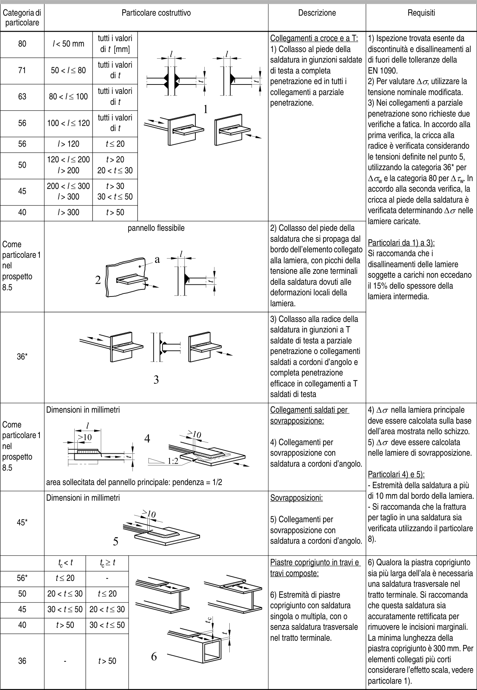

# EC3 — Tabella 8.5

[Pagina PDF 30](../pages/ec3-030.md)

## Celle estratte

| Rettangolo (punti PDF) | Testo della cella |
| --- | --- |
| [42.64, 76.08, 87.75, 80.1] |  |
| [42.64, 80.1, 87.75, 108.09] | Categoria di  particolare |
| [42.64, 108.09, 87.75, 135.63] | 80 |
| [42.64, 135.63, 87.75, 162.32] | 71 |
| [42.64, 162.32, 87.75, 190.37] | 63 |
| [42.64, 190.37, 87.75, 216.09] | 56 |
| [42.64, 216.09, 87.75, 232.11] | 56 |
| [42.64, 232.11, 87.75, 259.11] | 50 |
| [42.64, 259.11, 87.75, 286.11] | 45 |
| [42.64, 286.11, 87.75, 302.13] | 40 |
| [42.64, 302.13, 87.75, 395.12] | Come particolare 1 nel prospetto 8.5 |
| [42.64, 395.12, 87.75, 488.13] | 36* |
| [42.64, 488.13, 87.75, 578.13] | Come particolare 1 nel prospetto 8.5 |
| [42.64, 578.13, 87.75, 644.13] | 45* |
| [42.64, 644.13, 87.75, 660.15] |  |
| [42.64, 660.15, 87.75, 676.11] | 56* |
| [42.64, 676.11, 87.75, 692.13] | 50 |
| [42.64, 692.13, 87.75, 708.15] | 45 |
| [42.64, 708.15, 87.75, 726.56] | 40 |
| [42.64, 726.56, 87.75, 781.39] | 36 |
| [87.75, 76.08, 317.12, 80.1] |  |
| [87.75, 80.1, 317.12, 108.09] | Particolare costruttivo |
| [87.75, 108.09, 132.18, 135.63] | l < 50 mm |
| [87.75, 135.63, 132.18, 162.32] | 50 < l ≤ 80 |
| [87.75, 162.32, 132.18, 190.37] | 80 < l ≤ 100 |
| [87.75, 190.37, 132.18, 216.09] | 100 < l ≤ 120 |
| [87.75, 216.09, 132.18, 232.11] | l > 120 |
| [87.75, 232.11, 132.18, 259.11] | 120 < l ≤ 200        l > 200 |
| [87.75, 259.11, 132.18, 286.11] | 200 < l ≤ 300        l > 300 |
| [87.75, 286.11, 132.18, 302.13] | l > 300 |
| [87.75, 302.13, 317.12, 395.12] | pannello flessibile |
| [87.75, 395.12, 317.12, 488.13] |  |
| [87.75, 488.13, 317.12, 578.13] | Dimensioni in millimetri      area sollecitata del pannello principale: pendenza = 1/2 |
| [87.75, 578.13, 317.12, 644.13] | Dimensioni in millimetri |
| [87.75, 644.13, 132.18, 660.15] | tc < t |
| [87.75, 660.15, 132.18, 676.11] | t ≤ 20 |
| [87.75, 676.11, 132.18, 692.13] | 20 < t ≤ 30 |
| [87.75, 692.13, 132.18, 708.15] | 30 < t ≤ 50 |
| [87.75, 708.15, 132.18, 726.56] | t > 50 |
| [87.75, 726.56, 132.18, 781.39] | - |
| [132.18, 108.09, 225.92, 302.13] | tutti i valori      di t [mm]       tutti i valori          di t       tutti i valori          di t       tutti i valori 0          di t            t ≤ 20  0        t > 20    20 < t ≤ 30  0        t > 30    30 < t ≤ 50            t > 50 |
| [132.18, 644.13, 225.92, 781.39] | tc ≥ t         -      t ≤ 20  20 < t ≤ 30  30 < t ≤ 50        t > 50 |
| [225.92, 108.09, 317.12, 302.13] |  |
| [225.92, 644.13, 317.12, 781.39] |  |
| [317.12, 76.08, 417.09, 80.1] |  |
| [317.12, 80.1, 417.09, 108.09] | Descrizione |
| [317.12, 108.09, 417.09, 302.13] | Collegamenti a croce e a T: 1) Collasso al piede della saldatura in giunzioni saldate di testa a completa penetrazione ed in tutti i collegamenti a parziale penetrazione. |
| [317.12, 302.13, 417.09, 395.12] | 2) Collasso del piede della saldatura che si propaga dal bordo dell’elemento collegato alla lamiera, con picchi della tensione alle zone terminali della saldatura dovuti alle deformazioni locali della lamiera. |
| [317.12, 395.12, 417.09, 488.13] | 3) Collasso alla radice della saldatura in giunzioni a T saldate di testa a parziale penetrazione o collegamenti saldati a cordoni d’angolo e completa penetrazione efficace in collegamenti a T saldati di testa |
| [317.12, 488.13, 417.09, 578.13] | Collegamenti saldati per sovrapposizione:  4) Collegamenti per sovrapposizione con saldatura a cordoni d’angolo. |
| [317.12, 578.13, 417.09, 644.13] | Sovrapposizioni:  5) Collegamenti per sovrapposizione con saldatura a cordoni d’angolo. |
| [317.12, 644.13, 417.09, 781.39] | Piastre coprigiunto in travi e travi composte:  6) Estremità di piastre coprigiunto con saldatura singola o multipla, con o senza saldatura trasversale nel tratto terminale. |
| [417.09, 76.08, 530.78, 80.1] |  |
| [417.09, 80.1, 530.78, 108.09] | Requisiti |
| [417.09, 108.09, 530.78, 488.13] | 1) Ispezione trovata esente da discontinuità e disallineamenti al di fuori delle tolleranze della EN 1090. 2) Per valutare ∆σ, utilizzare la tensione nominale modificata. 3) Nei collegamenti a parziale penetrazione sono richieste due verifiche a fatica. In accordo alla prima verifica, la cricca alla radice è verificata considerando le tensioni definite nel punto 5, utilizzando la categoria 36* per ∆σw e la categoria 80 per ∆τw. In accordo alla seconda verifica, la cricca al piede della saldatura è verificata determinando ∆σ nelle lamiere caricate.  Particolari da 1) a 3): Si raccomanda che i disallineamenti delle lamiere soggette a carichi non eccedano il 15% dello spessore della lamiera intermedia. |
| [417.09, 488.13, 530.78, 644.13] | 4) ∆σ nella lamiera principale deve essere calcolata sulla base dell’area mostrata nello schizzo. 5) ∆σ deve essere calcolata nelle lamiere di sovrapposizione.  Particolari 4) e 5): - Estremità della saldatura a più di 10 mm dal bordo della lamiera. - Si raccomanda che la frattura per taglio in una saldatura sia verificata utilizzando il particolare 8). |
| [417.09, 644.13, 530.78, 781.39] | 6) Qualora la piastra coprigiunto sia più larga dell’ala è necessaria una saldatura trasversale nel tratto terminale. Si raccomanda che questa saldatura sia accuratamente rettificata per rimuovere le incisioni marginali. La minima lunghezza della piastra coprigiunto è 300 mm. Per elementi collegati più corti considerare l’effetto scala, vedere particolare 1). |
