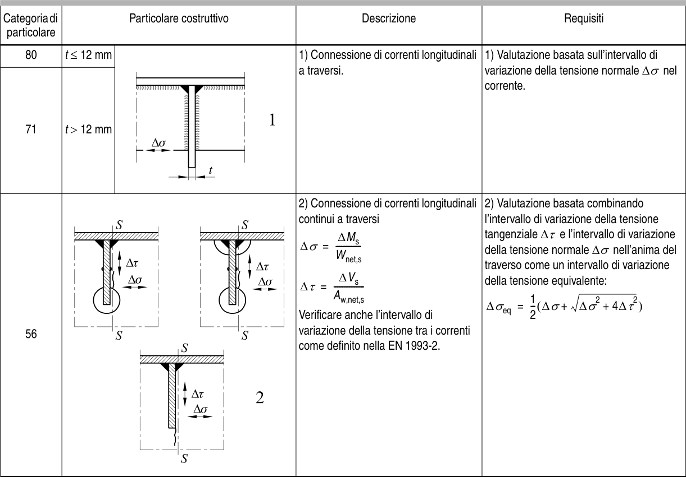

# EC3 — Tabella 8.9

[Pagina PDF 36](../pages/ec3-036.md)

## Celle estratte

| Rettangolo (punti PDF) | Testo della cella |
| --- | --- |
| [42.63, 76.08, 86.49, 80.1] |  |
| [42.63, 80.1, 86.49, 108.09] | Categoria di  particolare |
| [42.63, 108.09, 86.49, 124.11] | 80 |
| [42.63, 124.11, 86.49, 214.11] | 71 |
| [42.63, 214.11, 86.49, 416.35] | 56 |
| [86.49, 76.08, 253.17, 80.1] |  |
| [86.49, 80.1, 253.17, 108.09] | Particolare costruttivo |
| [86.49, 108.09, 124.55, 124.11] | t ≤ 12 mm |
| [86.49, 124.11, 124.55, 214.11] | t > 12 mm |
| [86.49, 214.11, 253.17, 416.35] |  |
| [124.55, 108.09, 253.17, 214.11] |  |
| [253.17, 76.08, 385.59, 80.1] |  |
| [253.17, 80.1, 385.59, 108.09] | Descrizione |
| [253.17, 108.09, 385.59, 214.11] | 1) Connessione di correnti longitudinali a traversi. |
| [253.17, 214.11, 385.59, 416.35] | 2) Connessione di correnti longitudinali continui a traversi       ∆Ms ∆σ =    --------------         Wnet,s       ∆Vs ∆τ =    -----------------          Aw,net,s Verificare anche l’intervallo di variazione della tensione tra i correnti come definito nella EN 1993-2. |
| [385.59, 76.08, 530.78, 80.1] |  |
| [385.59, 80.1, 530.78, 108.09] | Requisiti |
| [385.59, 108.09, 530.78, 214.11] | 1) Valutazione basata sull’intervallo di variazione della tensione normale ∆σ nel corrente. |
| [385.59, 214.11, 530.78, 416.35] | 2) Valutazione basata combinando l’intervallo di variazione della tensione tangenziale ∆τ e l’intervallo di variazione della tensione normale ∆σ nell’anima del traverso come un intervallo di variazione della tensione equivalente:         1∆σeq =   ( ∆σ+  ∆σ2 + 4∆τ2 )                        2-- |
