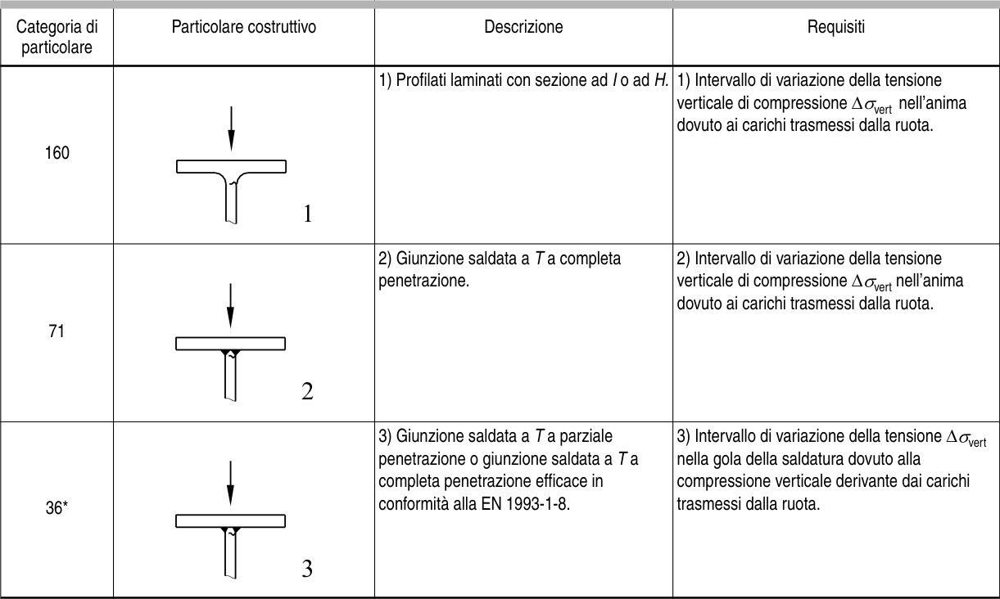

# EC3 — Tabella 8.10

[Pagina PDF 36](../pages/ec3-036.md)

## Celle estratte

| Rettangolo (punti PDF) | Testo della cella |
| --- | --- |
| [42.63, 449.37, 95.72, 453.42] |  |
| [42.63, 453.42, 95.72, 481.41] | Categoria di  particolare |
| [42.63, 481.41, 95.72, 568.41] | 160 |
| [42.63, 568.41, 95.72, 655.41] | 71 |
| [42.63, 655.41, 95.72, 741.65] | 36* |
| [95.72, 449.37, 179.09, 453.42] |  |
| [95.72, 453.42, 179.09, 481.41] | Particolare costr |
| [95.72, 481.41, 179.09, 568.41] |  |
| [95.72, 568.41, 179.09, 655.41] |  |
| [95.72, 655.41, 179.09, 741.65] |  |
| [179.09, 449.37, 371.07, 453.42] |  |
| [179.09, 453.42, 371.07, 481.41] | ruttivo                       Descrizione |
| [179.09, 481.41, 371.07, 568.41] | 1) Profilati laminati con sezione ad I o ad H. |
| [179.09, 568.41, 371.07, 655.41] | 2) Giunzione saldata a T a completa penetrazione. |
| [179.09, 655.41, 371.07, 741.65] | 3) Giunzione saldata a T a parziale penetrazione o giunzione saldata a T a completa penetrazione efficace in conformità alla EN 1993-1-8. |
| [371.07, 449.37, 530.78, 453.42] |  |
| [371.07, 453.42, 530.78, 481.41] | Requisiti |
| [371.07, 481.41, 530.78, 568.41] | 1) Intervallo di variazione della tensione verticale di compressione ∆σvert nell’anima dovuto ai carichi trasmessi dalla ruota. |
| [371.07, 568.41, 530.78, 655.41] | 2) Intervallo di variazione della tensione verticale di compressione ∆σvert nell’anima dovuto ai carichi trasmessi dalla ruota. |
| [371.07, 655.41, 530.78, 741.65] | 3) Intervallo di variazione della tensione ∆σvert nella gola della saldatura dovuto alla compressione verticale derivante dai carichi trasmessi dalla ruota. |
