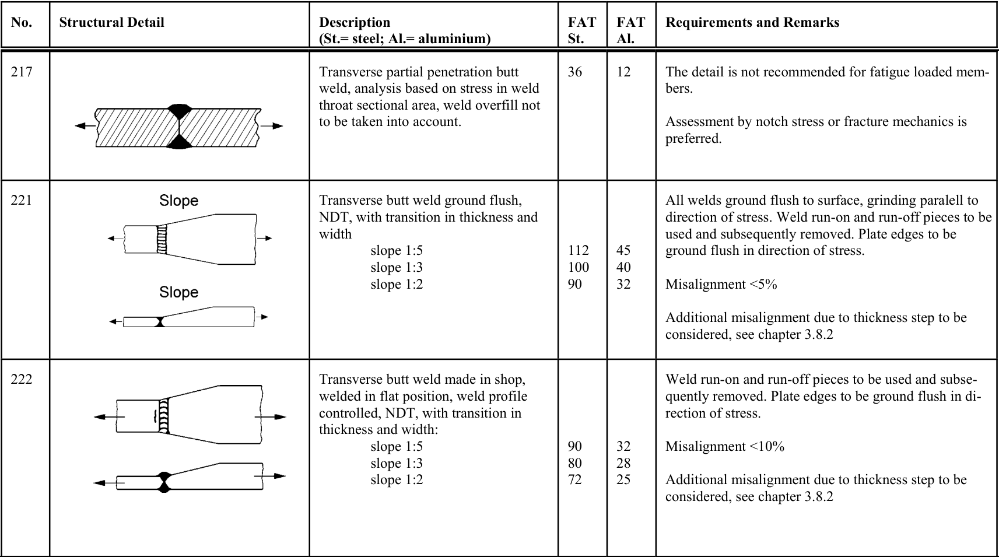

# IIW — Tabella 3.2-1

[Pagina PDF 51](../pages/iiw-051.md)

## Celle estratte

| Rettangolo (punti PDF) | Testo della cella |
| --- | --- |
| [83.6, 115.49, 117.35, 149.18] | No. |
| [83.6, 149.18, 117.35, 238.52] | 217 |
| [83.6, 238.52, 117.35, 361.28] | 221 |
| [83.6, 361.28, 117.35, 497.1] | 222 |
| [117.35, 115.49, 295.43, 149.18] | Structural Detail |
| [117.35, 149.18, 295.43, 238.52] |  |
| [117.35, 238.52, 295.43, 361.28] |  |
| [117.35, 361.28, 295.43, 497.1] |  |
| [295.43, 115.49, 466.13, 149.18] | Description (St.= steel; Al.= aluminium) |
| [295.43, 149.18, 466.13, 238.52] | Transverse partial penetration butt weld, analysis based on stress in weld throat sectional area, weld overfill not to be taken into account. |
| [295.43, 238.52, 466.13, 361.28] | Transverse butt weld ground flush, NDT, with transition in thickness and width         slope 1:5         slope 1:3         slope 1:2 |
| [295.43, 361.28, 466.13, 497.1] | Transverse butt weld made in shop, welded in flat position, weld profile controlled, NDT, with transition in thickness and width:         slope 1:5         slope 1:3         slope 1:2 |
| [466.13, 115.49, 499.67, 149.18] | FAT St. |
| [466.13, 149.18, 499.67, 238.52] | 36 |
| [466.13, 238.52, 499.67, 361.28] | 112 100 90 |
| [466.13, 361.28, 499.67, 497.1] | 90 80 72 |
| [499.67, 115.49, 533.21, 149.18] | FAT Al. |
| [499.67, 149.18, 533.21, 238.52] | 12 |
| [499.67, 238.52, 533.21, 361.28] | 45 40 32 |
| [499.67, 361.28, 533.21, 497.1] | 32 28 25 |
| [533.21, 115.49, 768.66, 149.18] | Requirements and Remarks |
| [533.21, 149.18, 768.66, 238.52] | The detail is not recommended for fatigue loaded mem- bers.  Assessment by notch stress or fracture mechanics is preferred. |
| [533.21, 238.52, 768.66, 361.28] | All welds ground flush to surface, grinding paralell to direction of stress. Weld run-on and run-off pieces to be used and subsequently removed. Plate edges to be ground flush in direction of stress.  Misalignment <5%  Additional misalignment due to thickness step to be considered, see chapter 3.8.2 |
| [533.21, 361.28, 768.66, 497.1] | Weld run-on and run-off pieces to be used and subse- quently removed. Plate edges to be ground flush in di- rection of stress.  Misalignment <10%  Additional misalignment due to thickness step to be considered, see chapter 3.8.2 |
