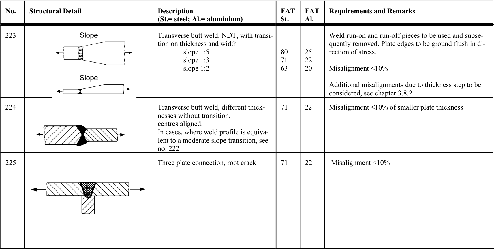

# IIW — Tabella 3.2-1

[Pagina PDF 52](../pages/iiw-052.md)

## Celle estratte

| Rettangolo (punti PDF) | Testo della cella |
| --- | --- |
| [83.6, 115.49, 117.35, 149.18] | No. |
| [83.6, 149.18, 117.35, 249.98] | 223 |
| [83.6, 249.98, 117.35, 326.9] | 224 |
| [83.6, 326.9, 117.35, 460.68] | 225 |
| [117.35, 115.49, 295.43, 149.18] | Structural Detail |
| [117.35, 149.18, 295.43, 249.98] |  |
| [117.35, 249.98, 295.43, 326.9] |  |
| [117.35, 326.9, 295.43, 460.68] |  |
| [295.43, 115.49, 466.13, 149.18] | Description (St.= steel; Al.= aluminium) |
| [295.43, 149.18, 466.13, 249.98] | Transverse butt weld, NDT, with transi- tion on thickness and width         slope 1:5         slope 1:3         slope 1:2 |
| [295.43, 249.98, 466.13, 326.9] | Transverse butt weld, different thick- nesses without transition, centres aligned. In cases, where weld profile is equiva- lent to a moderate slope transition, see no. 222 |
| [295.43, 326.9, 466.13, 460.68] | Three plate connection, root crack |
| [466.13, 115.49, 499.67, 149.18] | FAT St. |
| [466.13, 149.18, 499.67, 249.98] | 80 71 63 |
| [466.13, 249.98, 499.67, 326.9] | 71 |
| [466.13, 326.9, 499.67, 460.68] | 71 |
| [499.67, 115.49, 533.21, 149.18] | FAT Al. |
| [499.67, 149.18, 533.21, 249.98] | 25 22 20 |
| [499.67, 249.98, 533.21, 326.9] | 22 |
| [499.67, 326.9, 533.21, 460.68] | 22 |
| [533.21, 115.49, 768.66, 149.18] | Requirements and Remarks |
| [533.21, 149.18, 768.66, 249.98] | Weld run-on and run-off pieces to be used and subse- quently removed. Plate edges to be ground flush in di- rection of stress.  Misalignment <10%  Additional misalignments due to thickness step to be considered, see chapter 3.8.2 |
| [533.21, 249.98, 768.66, 326.9] | Misalignment <10% of smaller plate thickness |
| [533.21, 326.9, 768.66, 460.68] | Misalignment <10% |
