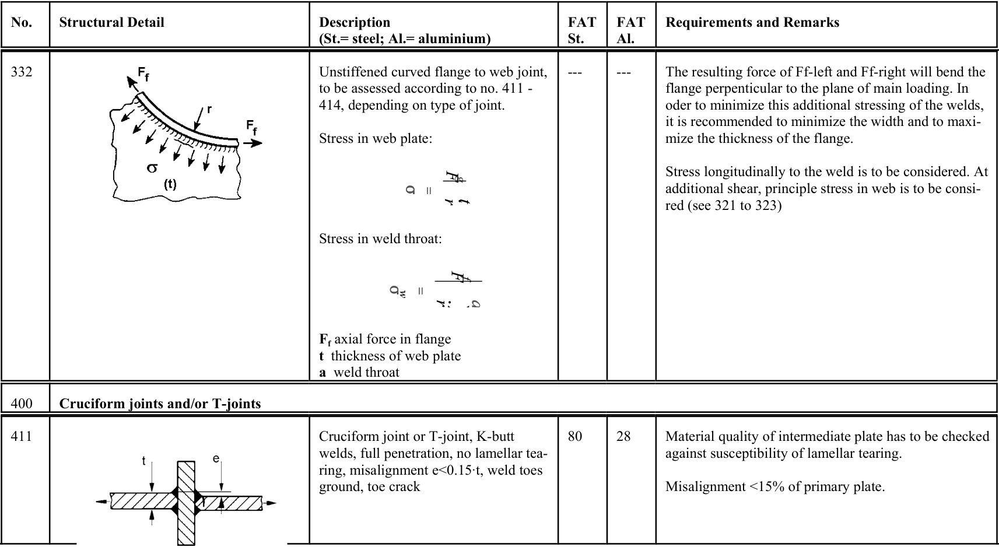

# IIW — Tabella 3.2-1

[Pagina PDF 60](../pages/iiw-060.md)

## Celle estratte

| Rettangolo (punti PDF) | Testo della cella |
| --- | --- |
| [83.66, 115.49, 117.32, 149.18] | No. |
| [83.66, 149.18, 117.32, 376.92] | 332 |
| [83.66, 376.92, 117.32, 399.59] | 400 |
| [83.66, 399.59, 117.32, 488.42] | 411 |
| [83.66, 488.42, 136.17, 494.97] |  |
| [117.32, 115.49, 295.49, 149.18] | Structural Detail |
| [117.32, 149.18, 295.49, 376.92] |  |
| [117.32, 376.92, 768.58, 399.59] | Cruciform joints and/or T-joints |
| [117.32, 399.59, 295.49, 488.42] |  |
| [136.17, 421.17, 280.65, 488.42] |  |
| [136.17, 488.42, 280.65, 494.97] |  |
| [280.65, 488.42, 768.58, 494.97] |  |
| [295.49, 115.49, 466.07, 149.18] | Description (St.= steel; Al.= aluminium) |
| [295.49, 149.18, 466.07, 376.92] | Unstiffened curved flange to web joint, to be assessed according to no. 411 - 414, depending on type of joint.  Stress in web plate:      Stress in weld throat:      Ff axial force in flange t thickness of web plate a weld throat |
| [295.49, 399.59, 466.07, 488.42] | Cruciform joint or T-joint, K-butt welds, full penetration, no lamellar tea- ring, misalignment e<0.15At, weld toes ground, toe crack |
| [466.07, 115.49, 499.61, 149.18] | FAT St. |
| [466.07, 149.18, 499.61, 376.92] | --- |
| [466.07, 399.59, 499.61, 488.42] | 80 |
| [499.61, 115.49, 533.15, 149.18] | FAT Al. |
| [499.61, 149.18, 533.15, 376.92] | --- |
| [499.61, 399.59, 533.15, 488.42] | 28 |
| [533.15, 115.49, 768.58, 149.18] | Requirements and Remarks |
| [533.15, 149.18, 768.58, 376.92] | The resulting force of Ff-left and Ff-right will bend the flange perpenticular to the plane of main loading. In oder to minimize this additional stressing of the welds, it is recommended to minimize the width and to maxi- mize the thickness of the flange.  Stress longitudinally to the weld is to be considered. At additional shear, principle stress in web is to be consi- red (see 321 to 323) |
| [533.15, 399.59, 768.58, 488.42] | Material quality of intermediate plate has to be checked against susceptibility of lamellar tearing.  Misalignment <15% of primary plate. |
