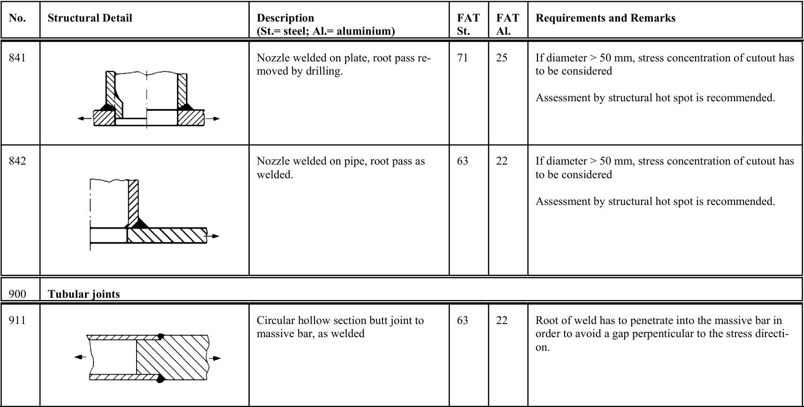

# IIW — Tabella 3.2-1

[Pagina PDF 72](../pages/iiw-072.md)

## Celle estratte

| Rettangolo (punti PDF) | Testo della cella |
| --- | --- |
| [83.67, 115.49, 117.33, 149.18] | No. |
| [83.67, 149.18, 117.33, 238.52] | 841 |
| [83.67, 238.52, 117.33, 350.7] | 842 |
| [83.67, 350.7, 117.33, 373.37] | 900 |
| [83.67, 373.37, 117.33, 462.18] | 911 |
| [117.33, 115.49, 295.51, 149.18] | Structural Detail |
| [117.33, 149.18, 295.51, 238.52] |  |
| [117.33, 238.52, 295.51, 350.7] |  |
| [117.33, 350.7, 768.54, 373.37] | Tubular joints |
| [117.33, 373.37, 295.51, 462.18] |  |
| [295.51, 115.49, 466.09, 149.18] | Description (St.= steel; Al.= aluminium) |
| [295.51, 149.18, 466.09, 238.52] | Nozzle welded on plate, root pass re- moved by drilling. |
| [295.51, 238.52, 466.09, 350.7] | Nozzle welded on pipe, root pass as welded. |
| [295.51, 373.37, 466.09, 462.18] | Circular hollow section butt joint to massive bar, as welded |
| [466.09, 115.49, 499.63, 149.18] | FAT St. |
| [466.09, 149.18, 499.63, 238.52] | 71 |
| [466.09, 238.52, 499.63, 350.7] | 63 |
| [466.09, 373.37, 499.63, 462.18] | 63 |
| [499.63, 115.49, 533.17, 149.18] | FAT Al. |
| [499.63, 149.18, 533.17, 238.52] | 25 |
| [499.63, 238.52, 533.17, 350.7] | 22 |
| [499.63, 373.37, 533.17, 462.18] | 22 |
| [533.17, 115.49, 768.54, 149.18] | Requirements and Remarks |
| [533.17, 149.18, 768.54, 238.52] | If diameter > 50 mm, stress concentration of cutout has to be considered  Assessment by structural hot spot is recommended. |
| [533.17, 238.52, 768.54, 350.7] | If diameter > 50 mm, stress concentration of cutout has to be considered  Assessment by structural hot spot is recommended. |
| [533.17, 373.37, 768.54, 462.18] | Root of weld has to penetrate into the massive bar in order to avoid a gap perpenticular to the stress directi- on. |
