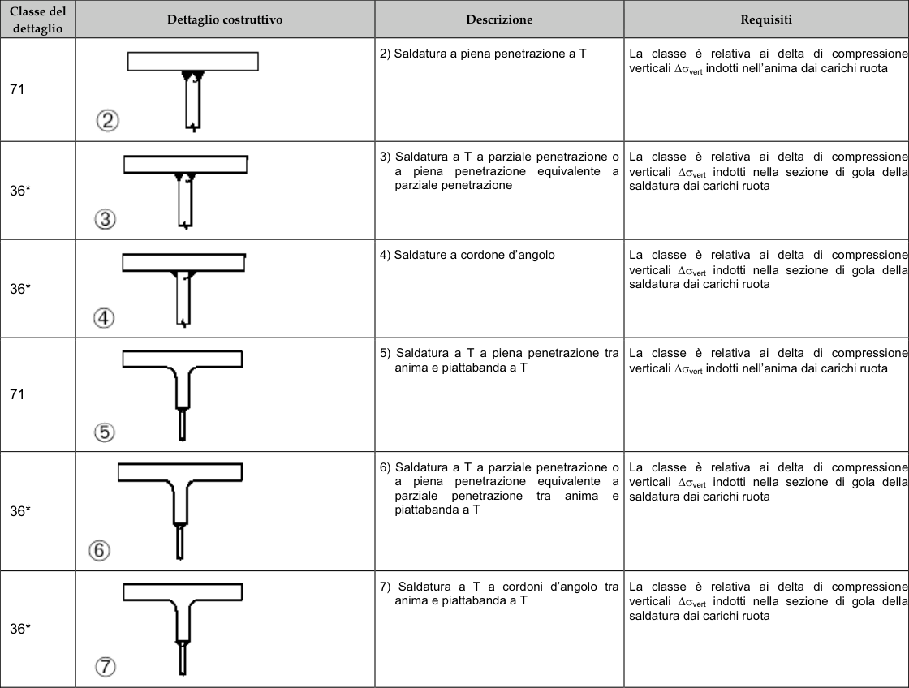

# NTC — Tabella PDF-133-T1

[Pagina PDF 133](../pages/ntc-133.md)

## Celle estratte

| Rettangolo (punti PDF) | Testo della cella |
| --- | --- |
| [73.73, 97.46, 110.81, 106.64] | Classe del |
| [73.73, 106.64, 110.81, 115.78] | dettaglio |
| [73.73, 115.78, 110.81, 166.89] | 71 |
| [73.73, 166.89, 110.81, 215.28] | 36* |
| [73.73, 215.28, 110.81, 263.67] | 36* |
| [73.73, 263.67, 110.81, 319.86] | 71 |
| [73.73, 319.86, 110.81, 378.66] | 36* |
| [73.73, 378.66, 110.81, 436.14] | 36* |
| [110.81, 97.46, 258.57, 115.78] | Dettaglio costruttivo |
| [110.81, 115.78, 258.57, 166.89] | 2 |
| [110.81, 166.89, 258.57, 215.28] |  |
| [110.81, 215.28, 258.57, 263.67] |  |
| [110.81, 263.67, 258.57, 319.86] |  |
| [110.81, 319.86, 258.57, 378.66] |  |
| [110.81, 378.66, 258.57, 436.14] |  |
| [258.57, 97.46, 381.09, 101.64] |  |
| [258.57, 101.64, 381.09, 111.53] | Descrizione |
| [258.57, 111.53, 381.09, 115.78] |  |
| [258.57, 115.78, 381.09, 166.89] | 2) Saldatura a piena penetrazione a T |
| [258.57, 166.89, 381.09, 215.28] | a piena penetrazione equivalente a parziale penetrazione |
| [258.57, 215.28, 381.09, 263.67] | 4) Saldature a cordone d’angolo |
| [258.57, 263.67, 381.09, 319.86] | 5) Saldatura a T a piena penetrazione tra anima e piattabanda a T |
| [258.57, 319.86, 381.09, 378.66] | parziale penetrazione tra anima e saldatura dai carichi ruota piattabanda a T |
| [258.57, 378.66, 381.09, 436.14] | anima e piattabanda a T |
| [381.09, 97.46, 521.48, 101.64] |  |
| [381.09, 101.64, 521.48, 111.53] | Requisiti |
| [381.09, 111.53, 521.48, 115.78] |  |
| [381.09, 115.78, 521.48, 166.89] | La classe è relativa ai delta di compressionel verticali ∆σvert indotti nell'anima dai carichi ruota |
| [381.09, 166.89, 521.48, 215.28] | 3) Saldatura a T a parziale penetrazione o La classe è relativa ai delta di compressione verticali ∆σvert indotti nella sezione di gola della saldatura dai carichi ruota |
| [381.09, 215.28, 521.48, 263.67] | La classe è relativa ai delta di compressionel verticali ∆σvert indotti nella sezione di gola dellal saldatura dai carichi ruota |
| [381.09, 263.67, 521.48, 319.86] | La classe è relativa ai delta di compressione verticali Δσvert indotti nell'anima dai carichi ruota |
| [381.09, 319.86, 521.48, 378.66] | 6) Saldatura a T a parziale penetrazione o La classe è relativa ai delta di compressione a piena penetrazione equivalente a verticali ∆σvert indotti nella sezione di gola dellal |
| [381.09, 378.66, 521.48, 436.14] | al  cl i c  s  a co o    c sn verticali ∆σvert indotti nella sezione di gola dellal saldatura dai carichi ruota |
